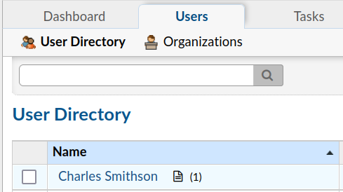

# Laboratorio: osTicket 🎫

1. Agregamos el dominio y la dirección IP al archivo **`/etc/hosts`**

---

2. Tenemos credenciales que nos dan previamente en **HackTheBox**
* `julie.clayton@inlanefreight.local:JulieC8765!`
* `kevin@inlanefreight.local:Fish1ng_s3ason!`

---

3. Nos loguemos con las credenciales de `kevin` en `http://support.inlanefreight.local/scp/login.php`

---

4. Ahora veremos el **ticket** que tuvo el usuario `Charles Smithson` con `Soporte`

    

---

5. Si vemos todos los mensajes veremos la contraseña que se envió.

    

