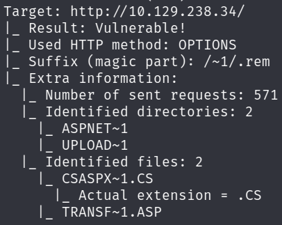

# Laboratorio: Atacking IIS Tilde Enumeration 🔢

1. Como sabemos que el servicio que vayamos a **vulnerar** es un `IIS`, podemos enumerar por archivos que se encuentren presentes en el, para eso usaremos [IIS-Tilde-Enumeration](https://github.com/irsdl/IIS-ShortName-Scanner)

* `COMMAND`

**Output**

    

---

2. Como existen nombres de archivo que empiezan con **`TRANS`**, enumeraremos usando un diccionario **personalizado**
* `egrep -r ^transf /usr/share/seclists/ | sed 's/^[^:]*://' > /tmp/list.txt`

---

3. Ahora usaremos `fuff` para enumerar los posibles nombres de archivo
* ``

**Output:** `transfer.aspx`