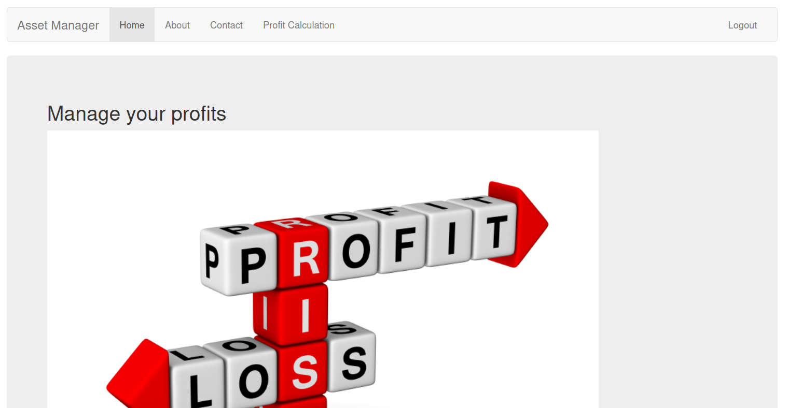

# Laboratorio: Mass Assigment 💆‍♂️

1. Nos **autenticamos** en el servicio `SSH` con las credenciales que nos dan en `HackTheBox` y analizamos el archivo **`/opt/asset-manager/app.py`**

* `/register`

```python
username=request.form['username']
password=request.form['password']
try:
    if request.form['active']:
        cond=True
except:
    cond=False
<SNIP>
    cur.execute('insert into users values(?,?,?)',(username,password,cond))
<SNIP>
```

* Vemos que la función **`register`** espera **3 valores por el método POST** `username` & `password` & `active`, en el caso de `active` si no lo detecta le asigna un **`false`** y si lo detecta le asigna **`true`**.

* `/login`

```python
for i,j,k in cur.execute('select * from users where username=? and password=?',(username,password)):                                 
    if k:
        session['user']=i
        return redirect("/home",code=302)
    else:
        return render_template('login.html',value='Account is pending for approval')
```
* Vemos que una vez que proporcionamos credenciales, las busca en la **base de datos**
* `i -> username` & `j -> password` & `k -> active` (**active** lo sabemos por que vimos el funcionamiento de **`/register`**)
* Si `k -> active` el **verdadero** lo que hace es redirigirnos a `/home`, caso contrario, no lo hace.

---

2. Con todo lo anterior en mente, sabemos que de alguna forma tenemos que incluir **`active`** en la petición por `POST` que hagamos. Así que al momento de **registrarnos** interceptamos la solicitud.

<p align="center">
    
</p>

* En un principio, el parámetro **`active`** no existe, por lo que si lo agregamos y le asignamos cualquier valor, lo forzamos a que el registro en la base de datos se almacene con un `valor de True` y así cuando nos logueemos seremos redirigidos a `home`

```
username=test&password=test&active=test
```

---

3. Después de enviar la petición modificada, nos logueamos y veremos que somos redirigidos a `/home`

<p align="center">
    
</p>