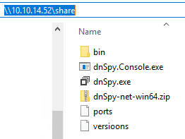

# Laboratorio: Skill Assessment III 🐱‍👤

1. Nos logueamos en el servicio **rdp** con las credenciales que nos dan en **`HackTheBox`**
* `xfreerdp /v:[IP] /u:Administrator /p:xcyj8izxNVzhf4z`
---
2. El archivo **`MultimasterAPI.dll`** se encuentra en el directorio `C:\inetpub\wwwroot\bin`
---
3. Para analizar este archivos necesitamos de **`dnSpy`**, como la máquina no cuenta con conexión a internet, lo que haremos es descarganos **`dnSpy`** en nuestra máquina de atacante. [dnSpy](https://github.com/dnSpy/dnSpy/releases/tag/v6.1.8)

* Ahora levantaremos un servicio **smb**, en el mismo directorio de **`dnSpy`**
    * `impacket-smbserver share $(pwd) -smb2support`

* Accedemos a ese servicio desde la máquina víctima

<p align="center">
    
</p>

* Movemos el **comprimido** al escritorio, lo descomprimimos y ejecutar **`dnSpy.exe`**
---
4. Una vez abrimos **`dnSpy`** analizamos el archivo **`MultimasterAPI.dll`**, el archivo en el que se encuentran **`harcodeadas`** las credenciales de **MSSQL** es
* **`MultimasteAPI.dll -> MultimasteAPI.Controllers -> ColleagueControllers -> GetColleagues`**

* **GetColleagues**

```cs
string connString = "server=localhost;database=Hub_DB;uid=finder;password=D3veL0pM3nT!;";
```

**Flag Final:** `D3veL0pM3nT!` 🏴