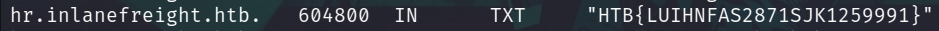

# Laboratorio DNS 🌐

Como primer punto tenemos que **enumerar** los puertos disponibles en la máquina objetivo

```bash
nmap -p- -sS -Pn -n <IP> -oN ports
```

**Output**

<p align="center">
    
</p>

---

Primero, añadimos la IP y dominio al archivos `/etc/hosts`

<p align="center">
    
</p>

---

Usamos la `dnsenum` para enumerar subdminios.

* `dnsenum --dnsserver [IP] --enum -p 0 -s 0 -o subdomains.txt -f /usr/share/seclists/Discovery/DNS/shubs-subdomains.txt inlanefreight.htb`

**Output**
```
helpdesk.inlanefreight.htb.              604800   IN    A
control.inlanefreight.htb.               604800   IN    A
ns.inlanefreight.htb.                    604800   IN    A
hr.inlanefreight.htb.                    604800   IN    A
```

---

Ahora lo que haremos para cada subdominio es seguir esta expresión
* `dig axfr @[IP] [Subdominio]`
* El subdominio con la **flag** 🏴 es: `hr.inlanefreight.htb`

<p align="center">
    
</p>