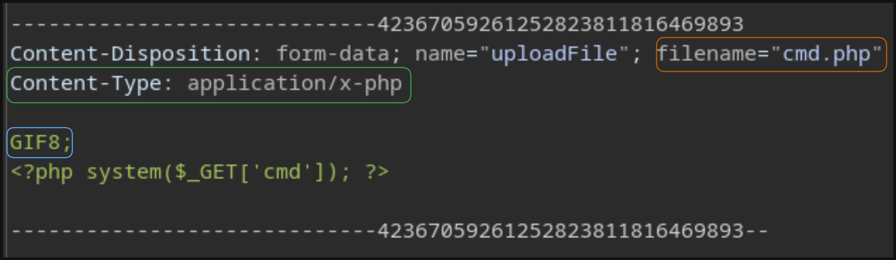

# Laboratorio: Upload Exploitation 📃

1. Visitamos la página web

<p align="center">
    
</p>

---

2. Primero, eliminamos las validaciones en el `Lado Del Cliente`

```
onchange="checkFile(this)"
accept=".jpg,.jpeg,.png"
```

---

3. Interceptamos la petición con **Burp Suite**

<p align="center">
    
</p>

* Cambiaremos el `Content-Type` por **image/jpg** y haremos un **ataque de doble extensión** para cambiar el nombre del archivo por `cmd.gif.phar`

* Modificaremos los **Magic Numbers** del archivo y colocaremos `GIF8;`

---

4. Si tratamos de **subir el archivo** vemos que lo logramos, después de esto, podemos ejecutar comandos y leer la **flag** 🏴

* **URL:** `http://[IP]/profile_images/cmd.gif.phar?cmd=cat%20/flag.txt`

**Output**
`HTB{m461c4l_c0n73n7_3xpl0174710n}`