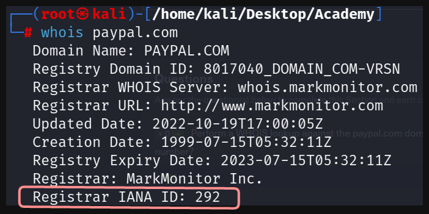

# Laboratorio: WHOIS ⁉


1. Para encontrar el **IANA** (ID de la Autoridad de Números Asignados de Internet) usaremos **`whois`**

```sql
whois paypal.com
```


2. Para conseguir el **correo del administrador** de **[netflix.com](http://netflix.com)** usaremos **whois**

```sql
whois netflix.com
```

