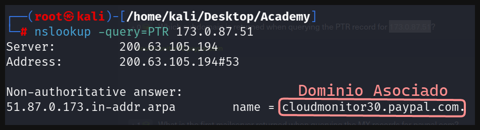
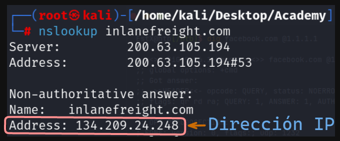

# Laboratorio: DNS/Dig 🌐

1. Si queremos conocer la **dirección IP** asociada a un **dominio** usaremos **`nslookup`**

```sql
nslookup <Dominio>
```



2. Podemos realizar diferentes tipos de **solicitudes** con **`nslookup`** en este caso realizaremos una **petición PTR** a la **dirección IP 173.0.87.51**

```sql
dig -query=PTR 173.0.87.51
```


3. Para revisar **servidores de correo** asociados a un dominio usaremos **`dig`**

```sql
dig MX <Dominio>
```



- El primer **servidor de correo asociado** es **mx1.paypalcorp.com**