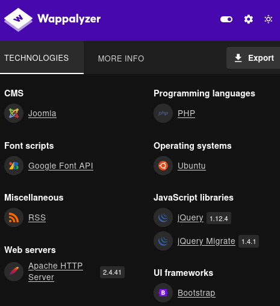
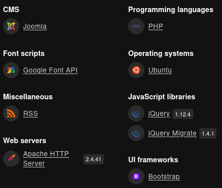
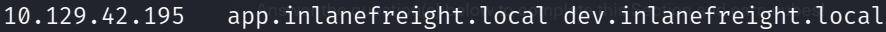

# Laboratorios: Identificación Activa de Infraestructura 🏦

1. Para comenzar tendremos que realizar **Virtual Hosting** con la **dirección IP** y los dos subdominios.
- Archivo **`/etc/hosts`**

```sql
<IP> app.inlanefreight.local app.inlanefreight.local dev.inlanefreight.local
```



```
🤖 Al realizar Virtual Hosting logramos conseguir más información o acceder a otros servicios.
```

2. Usaremos **Wappalyzer** para conseguir información información sobre el **subdominio `app.inlanefreight.local`**



- **Información Recolectada**
    - **CMS** (Sistema de Gestión de Contenidos): Joomla.
    - **Servidor Web:** Apache HTTP Server 2.4.41.
    - **Sistema Operativo:** Ubuntu.

3. De igual forma haremos lo mismo para el **subdominio `dev.inlanefreight.local`**



- **Información Recolectada**
    - **CMS** (Sistema de Gestión de Contenidos): Joomla.
    - **Servidor Web:** Apache HTTP Server 2.4.41.
    - **Sistema Operativo:** Ubuntu.