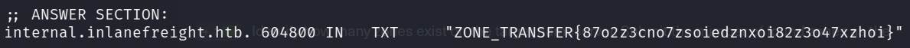
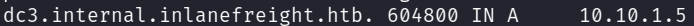
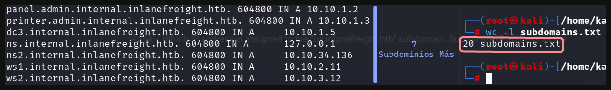

# Laboratorio: Enumeración Activa de Subdominios 🌍

1. Usaremos **`dig`** para obtener información de la **dirección IP**

```sql
dig axfr <Dominio> @<IP>
```



- Notamos que el **servidor de nombres** es **`ns.inlanefreight.htb`**
- En este **dominio** existen 2 zonas **`ns.inlanefreight.htb`** y **`root.inlanefreight.htb`**

2. Si ejecutamos el comando anterior veremos que conseguimos **múltiples subdominios** y realizar la petición de un registro **TXT** será tedioso, así que …
    - Primero **extraeremos todos los subdominios** con un comando en bash y los guardaremos en un **archivo**
        ```sql
        dig axfr <Dominio> @<IP> | awk '{print $1}' | grep 'inlane' | sort -u | uniq > <Nombre Archivo>.txt
        ```
        
    - Ya con todos los **subdominios en un archivo** ejecutaremos un script para realizar un petición de registro TXT a cada uno de ellos.
        
        ```sql
        while read subdominio; do dig TXT "$subdominio" @<IP>; done < <Lista de Subdominios>.txt;
        ```
        
    - Ahora solo nos queda buscar en todo el **output** del comando anterior y encontraremos la **bandera**
        
        
        

3. Para obtener aún más **subdominios** usamos el **script anterior** y **únicamente** cambiaremos el tipo de registro por **axfr**
    
    ```sql
    while read subdominio; do dig axfr "$subdominio" @<IP>; done < <Lista de Subdominios>.txt;
    ```
    
    - Buscamos en el **todo el output anterior** y encontraremos el **dominio** que se relaciona con la IP **`10.10.1.5`**
        
        
        
4. Para contar la cantidad de **subdominios finales encontrados** usaremos la lista de **subdominios antes realizada** y el **output** del script **del ataque de transferencia de zona.**
    
    
    
    - La **lista de subdominios inicial** cuenta con 20 **subdominios** y al momentos de realizar el **ataque de transferencia de zona** contamos **7 subdominios más,** esto nos da un total de **`27 subdominios`**