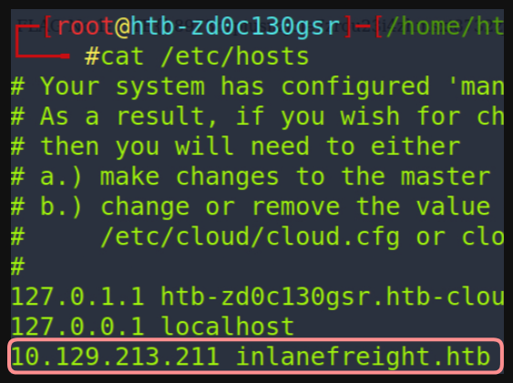
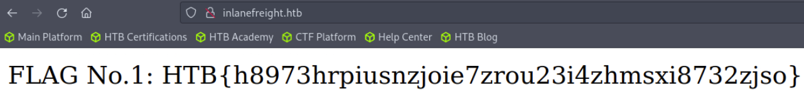
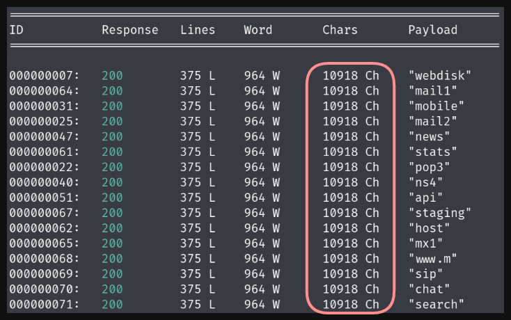
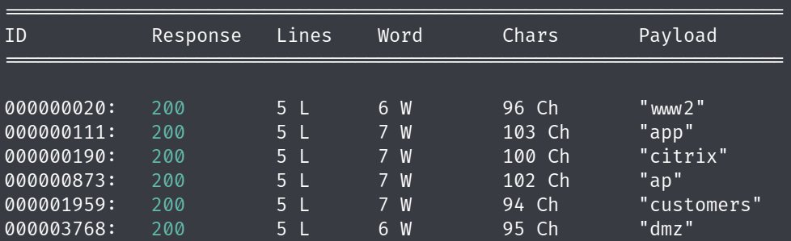
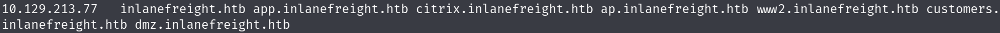
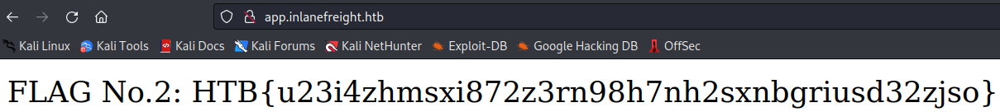
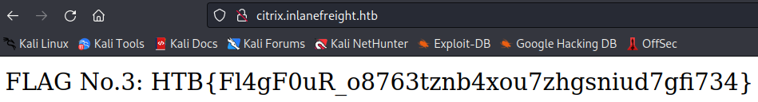
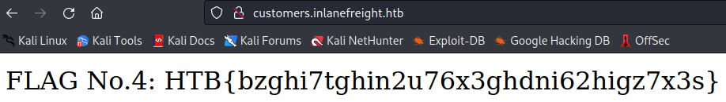
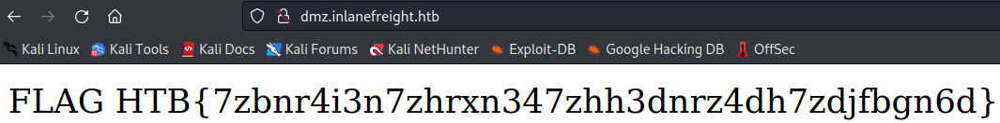

# Laboratorio: Virtual Hosting 🤖

1. Para empezar tenemos que hacer **virtual hosting**, para eso debemos incluir la **IP** que de la **máquina victima** y el **dominio (FQDN)**
- Archivo **`/etc/hosts`**



2. Ahora visitamos ese **dominio** en el navegador y **obtenemos la `Primera Bandera`**



3. Para enumerar **vhosts** usaremos **wfuzz** 

```bash
wfuzz -c -t <N Hilos> --hc=404 --hh=10918 -w <Diccionario> -H "Host: FUZZ.inlanefreight.htb" inlanefreight.htb
```

- **`-c`** Veremos el **output** del programa con colores.
- **`-t`** Especificamos el número de hilos a usar.
- **`--hc=404`** Ocultamos el código de estado **404** (Indica que ese subdominio no existe)
- **`--hh=10918`** Ocultamos los resultados en los cuales la cantidad de caracteres de la página sea de **10918.**
    
    
    
    - Si no colocamos este parámetro vemos múltiples subdominios, los cuales pueden llegar a tener información irrelevante o sean una **página default,** entonces quitamos todos los que contengan **10918 caracteres.**

El output que recibimos es el siguiente:



```
✅ Todos estos vhosts encontrados tenemos que añadirlos al archivo `/etc/hosts`
```



4. La **bandera #2** está en el subdominio **`app.inlanefreight.htb`**



5. La **bandera #3** está en el subdominio **`citrix.inlanefreight.htb`**



6. La **bandera #4** está en el subdominio **`customers.inlanefreight.htb`**



7. Finalmente, la **última bandera** está en el subdominio **`dmz.inlanefreight.htb`**

