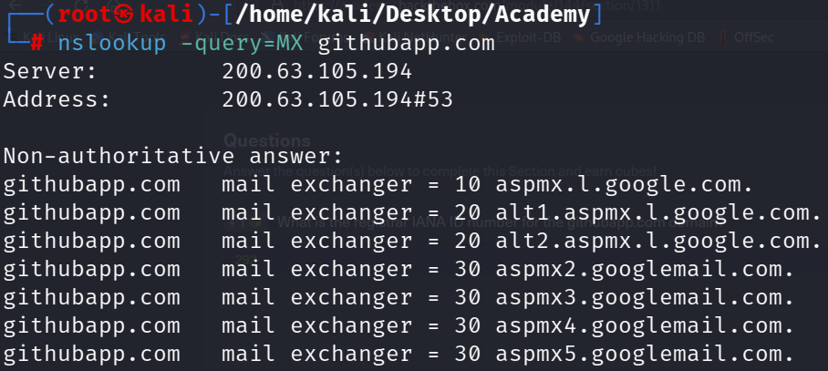
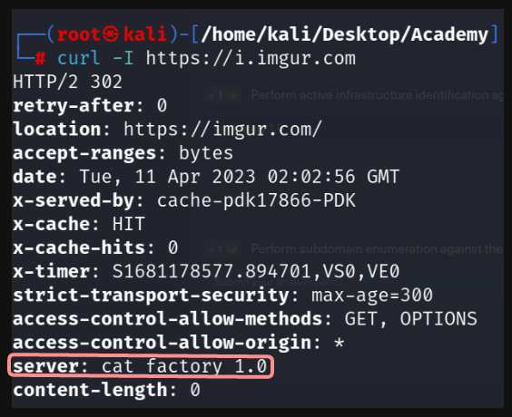
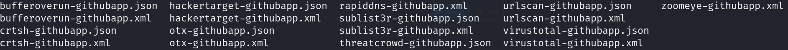
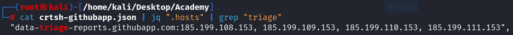

# Laboratorio: Final 🦴

1. Para conseguir el **IANA ID** del dominio [githubapp.com](http://githubapp.com/) usaremos **WHOIS**

```bash
whois githubapp.com
```


2. Usaremos **nslookup** para consultar los registros **MX** de [githubapp.com](http://githubapp.com/)

```bash
nslookup -query=MX githubapp.com
```



- El último **servidor de correos** es [aspmx5.googlemail.com](http://aspmx5.googlemail.com/)

3. Para encontrar el servidor de nombres de **`[https://i.imgur.com](https://i.imgur.com)`** usaremos **`dig`**
    
    ```bash
    curl -I https://i.imgur.com
    ```
    
    
    
4. Ahora usaremos **theHarvester** para enumerar todos los subdominios de [githubapp.com](http://githubapp.com)
    - **Primero**, crearemos una lista de **motores.**
        
        ```bash
        baidu
        bufferoverun
        crtsh
        hackertarget
        otx
        projecdiscovery
        rapiddns
        sublist3r
        threatcrowd
        trello
        urlscan
        vhost
        virustotal
        zoomeye
        ```
        
    - **Luego,** usaremos el siguiente **script** para que **`theHarvester`** use todos los **motores** y realice la **búsqueda de subdominios.**
        
        ```bash
        while read motores; do theHarvester -d "githubapp.com" -b "$motores" -f "$motores-githubapp.com"; done < motores.txt
        ```
        
    - **Una vez termine** de ejecutarse el script nos dejará múltiples archivos con la información que haya recolectado.
        
        
        
5. **Por último**, nos queda buscar en que archivo se encuentra el subdominio que contenga **`triage`**
- **Archivo:** `crtsh-githubapp.json`

Si queremos ver que **subdominio** tiene la palabra **`triage`** usaremos el siguiente script

```bash
cat crtsh-githubapp.json | jq ".hosts" | grep "triage"
```

- **`jq ".hosts"`** Con **jq** mostraremos el contenido del archivo en **formato json,** y con **“.hosts”** accedemos al campo en donde se encuentran los **subdominios**.
- **`grep "triage"`** Filtraremos por el subdominio que contenga la palabra **triage**



- El **subdominio** es [data-triage-reports.githubapp.com](http://data-triage-reports.githubapp.com/)