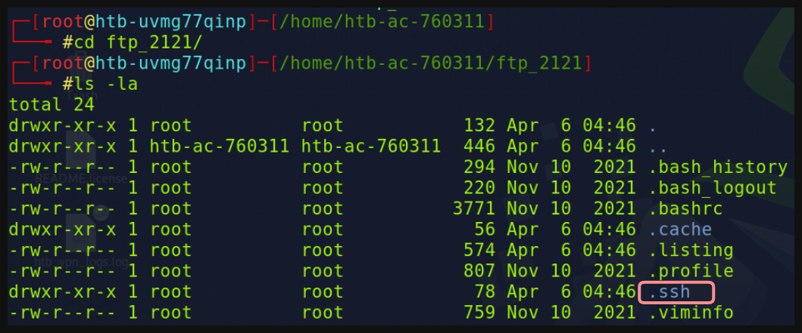

# Práctica Final: Fácil 🐧


Como primer punto tenemos que **enumerar** los puertos disponibles en la máquina objetivo

```bash
nmap -p- -sS -Pn -n <IP> -oN ports
```

- **`-p-`** Escanear todos los puertos.
- **`-sS`** Escaneo sigiloso.
- **`-oN`** Exportar la evidencia en formato **‘Nmap’** (Tal cual como nos muestra por consola.
- **`-Pn`** Toma en cuenta que todos los **hosts** está en línea.
- **`-n`** No realice **resolución DNS.**


Cómo **pista** nos indican que tenemos las credenciales **`ceil:qwer1234`**

)

---

Usaremos **wget** para descargar todos los archivos que se encuentren en el **servidor FTP** de la aquina objetivo.

```bash
wget --no-passive -m ftp://<Usuario>:<Contraseña>@<IP>
```


Cambiamos el nombre del directorio que nos creo el comando anterior para mayor ***facilidad***

```bash
mv <Directorio Creado Previamente> <Nuevo Nombre>
```


Si listamos el directorio vemos que no obtuvimos información relevante


---

### En el output de nmap 👁 notamos que tenemos el puerto `2121` abierto y se ejecuta el servicio `ccproxy-ftp` , teniendo eso en cuenta descargaremos el contenido de ese servicio.

---

```bash
wget --no-passive -m ftp://<Usuario>:<Contraseña>@<IP>:2121
```

De igual manera el comando anterior nos creará un directorio, le cambiamos el nombre para mayor facilidad


Si listamos el contenido del directorio…



- Tenemos un directorio **.ssh** que posiblemente cuente con **claves rsa** las cuales nos servirán para autenticarnos por ssh.

Contenido del directorio **`.ssh`**


Le cambiamos los permisos al archivo **`id_rsa`** a **600**, con esto decimos que esta clave le pertenece únicamente a un usuario con lo cual evitaremos problemas al **autenticarnos por ssh.**

```bash
chmod 600 id_rsa
```


Nos autenticamos por **ssh** con la **clave id_rsa** encontrada previamente

```bash
ssh <Usuario>@<IP> -i <clave id_rsa>
```


Una vez autenticados nos dirigimos al **directorio `/home/flag`** y conseguimos la **“flag”**

