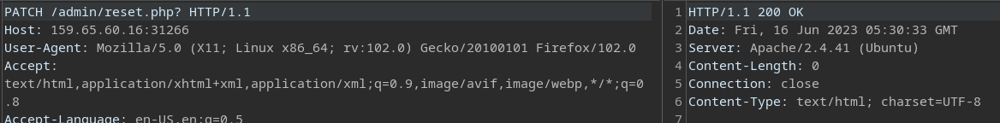
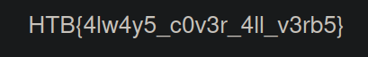

# Laboratorio: Bypass Basic Authentication 🚗

1. Visitamos la web 

    

---
2. Interceptamos la petición con **`Burp Suite`** y probamos a cambiar por los demás métodos HTTP `POST` `PUT` `DELETE` `PATCH` `HEAD`

    

* A la final el método usado para **`bypassear`** la autenticación fue **`PATCH`**
---
3. En la web veremos la **flag** 🏴

    

