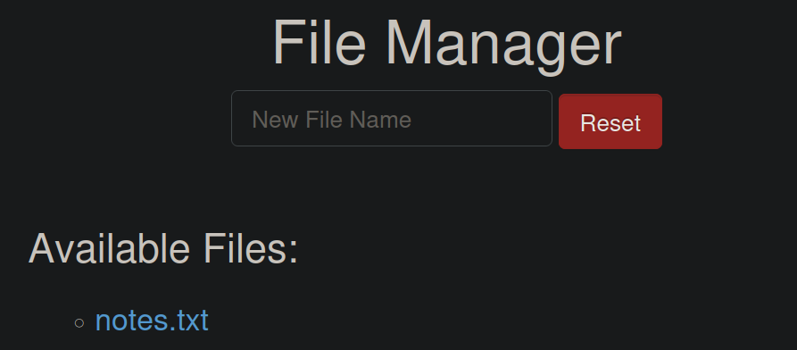
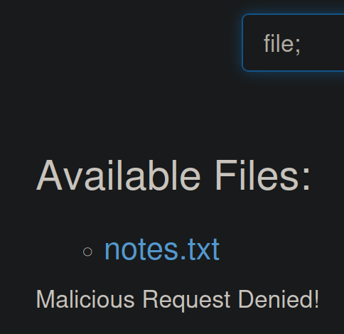
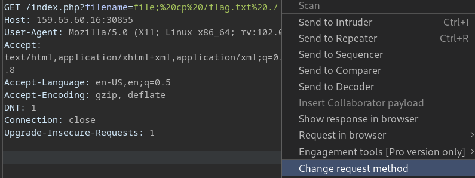
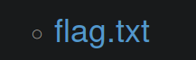

# Laboratorio: Bypass Basic Filters 🚗

1. Visitamos la web 

    

---

2. Si creamos un archivo normalmente notaremos que no existe ningún problema, pero si colocamos un `;` nos lo tomará como un `intento malicioso`

    

---

3. Interceptamos la solicitud con **`Burp Suite`** y cambiaremos el método HTTP
* En la petición colocamos la pista de **HackTheBox**  ` file; cp /flag.txt ./`
* **URL:** `http://[IP]/index.php?filename=file; cp /flag.txt ./`

    

* Damos clic en **`Change request method`**

---
4. Una vez que se cambie la petición la enviamos, recargamos la página y podremos leer la **flag** 🏴

    

* **Flag:** `HTB{b3_v3rb_c0n51573n7}`