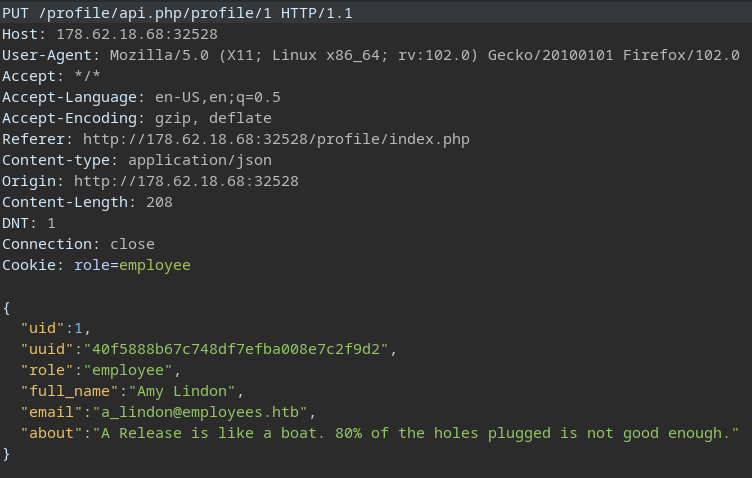

# Laboratorio: IDOR in Insecure API's

1. Visitamos la web 

<p align="center">
    
</p>

---

2. Ahora nos dirigimos a la parte de **`Edit Profile`**, damos clic en **`Update Profile`** e interceptamos la petición con **`Burp Suite`**

<p align="center">
    
</p>

* Los métodos HTTP son:
  * **GET:** Usado para conseguir información.
  * **POST:** Usado para crear un registro.
  * **PUT:** Actualizar.
  * **DELETE:** Eliminar.

---

3. Con lo anterior en mente, si queremos leer información de otro **usuario**, usaremos el método **`GET`** 

* **Método:** `GET /profile/api.php/profile/5 HTTP/1.1`
  * Usamos `GET` para leer información.
  * Colocamos el **id** `5` ya que queremos leer el **`uuid`** de este usuario.
  * El resto de la petición se mantiene igual.

* **Output**
```json
{
    "uid":"5",
    "uuid":"eb4fe264c10eb7a528b047aa983a4829",
    "role":"employee",
    "full_name":"Callahan Woodhams",
    "email":"c_woodhams@employees.htb",
    "about":"I don't like quoting others!"
}
```