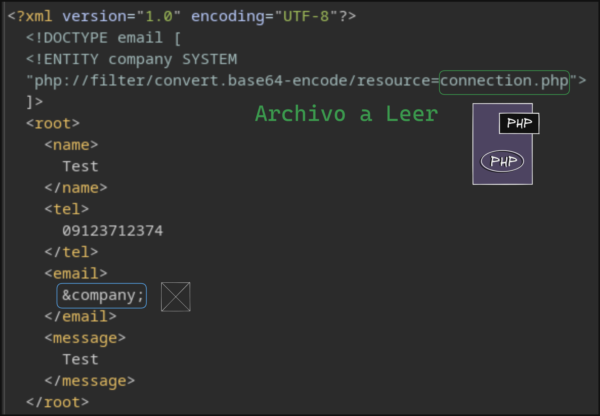

# Laboratorio: Local File Disclosure 📁

1. Una vez que estemos en la página web, lo que tenemos que hacer es interceptar la solicitud de **`Contact Form`**

<p align="center">
    
</p>

---

2. El output recibido por el serividor estará en **base64** por lo cual lo decodeamos y veremos el código fuente del archivo **`connetion.php`**

```bash
echo -n "PD9waHAKCiRhcGlfa2V5ID0gIlVUTTFOak0wTW1SekoyZG1jVEl6TkQwd01YSm5aWGRtYzJSbUNnIjsKCnRyeSB7CgkkY29ubiA9IHBnX2Nvbm5lY3QoImhvc3Q9bG9jYWxob3N0IHBvcnQ9NTQzMiBkYm5hbWU9dXNlcnMgdXNlcj1wb3N0Z3JlcyBwYXNzd29yZD1pVWVyXnZkKGUxUGw5Iik7Cn0KCmNhdGNoICggZXhjZXB0aW9uICRlICkgewogCWVjaG8gJGUtPmdldE1lc3NhZ2UoKTsKfQoKPz4K" | base64 -d
```

* **Output**
```php
<SNIP>
$api_key = "UTM1NjM0MmRzJ2dmcTIzND0wMXJnZXdmc2RmCg";
<SNIP>
```
